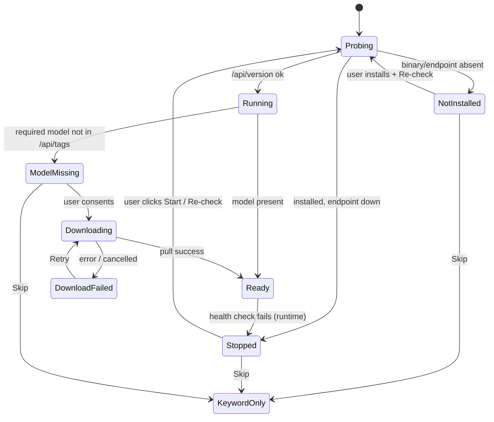
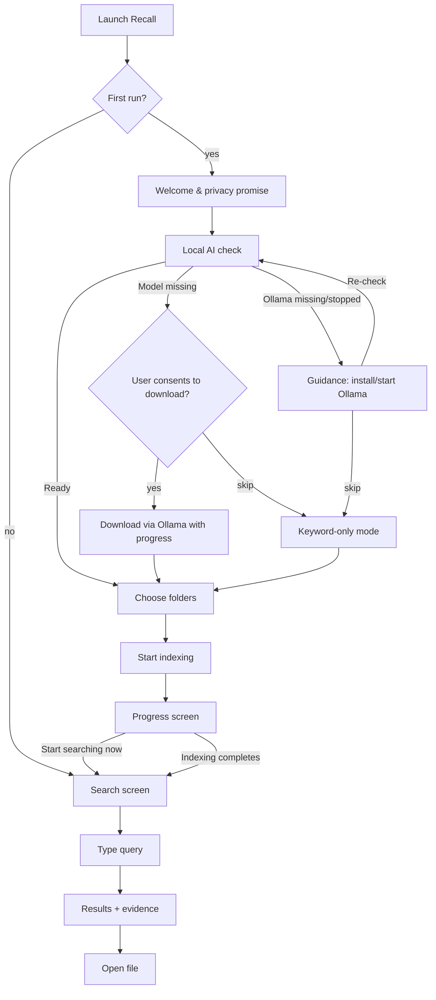
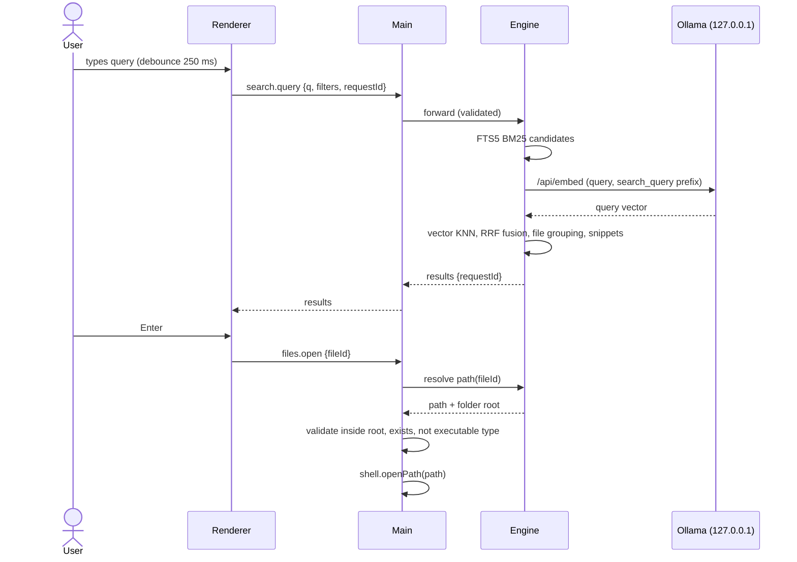
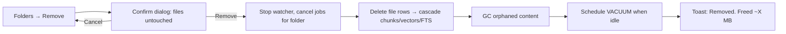
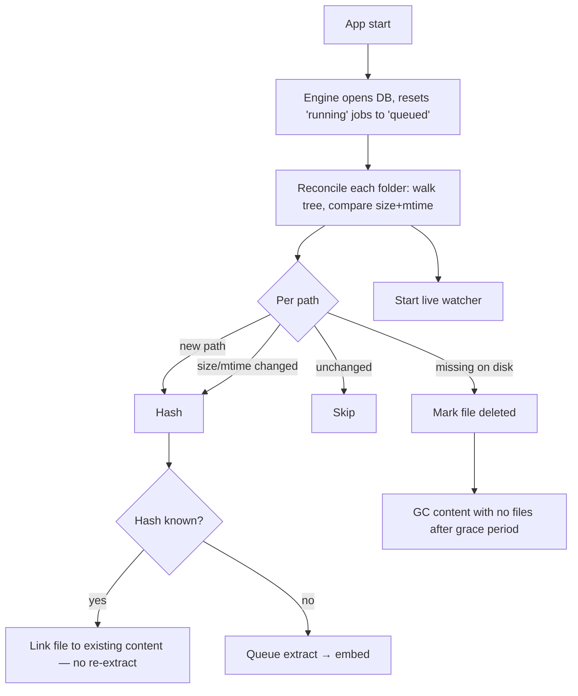

# 02 — UX and User Flows

> Status: **Draft for approval** · Related: [01 Product](01-product-specification.md) · [03 Architecture](03-system-architecture.md) · [06 Security](06-security-and-privacy.md)

## 1. Design principles

1. **Search is the home screen.** The app opens to a focused search box. Everything else is secondary.
2. **Evidence before opinion.** Every result shows *the passage that matched* and *why*. No unexplained scores, no chatbot persona.
3. **Honest status.** Indexing progress, AI availability, and confidence are always visible and phrased in plain language. Never imply a capability that is currently off.
4. **Read-only by default.** Nothing in the MVP UI can modify a user file. Destructive-sounding actions ("Remove folder") explicitly state "your files are not touched".
5. **Keyboard-first, mouse-friendly.** Every action reachable by keyboard; common ones have shortcuts.
6. **Calm, not clever.** Minimal animation, no gradients-as-AI tropes, no sparkle icons.

## 2. Visual direction

A **quiet productivity tool** in the family of Spotlight/Raycast (instant search) + Explorer's details pane (trustworthy file information) — not a chat app.

| Aspect | Direction |
|---|---|
| Layout | Narrow left rail (icons + labels) · central results list · right evidence pane (resizable, collapsible). Native Windows title bar in MVP. |
| Typography | System UI font (`Segoe UI Variable` on Windows 11, falls back to `Segoe UI`). Body 14 px, evidence passages 15 px with 1.55 line height for readability. Monospace (`Cascadia Mono`, fallback `Consolas`) for paths and code passages. |
| Colour | Neutral greys; single accent (deep teal) for focus and primary actions; highlight marks use a soft amber background with dark text (≥ 4.5:1 contrast). Follows the system light/dark theme. |
| Density | Comfortable by default; result cards ~88 px tall; evidence pane uses full height. |
| Iconography | File-type icons (PDF, DOCX, MD, code, image) + simple line icons. No AI/sparkle iconography. |
| Motion | ≤ 150 ms fades; honours `prefers-reduced-motion`. |
| Tone of copy | Plain, specific, calm. "Recall couldn't read this PDF because it's password-protected." not "Oops! Something went wrong." |

Implementation: React + Tailwind CSS + Radix UI primitives (accessible dialogs, menus, tooltips, tabs) — see [03 §3](03-system-architecture.md).

## 3. Information architecture

```
Recall window
├── Search            (default; Ctrl+K focuses the box from anywhere)
│   ├── Results list
│   └── Evidence / document detail pane
├── Ask               (Stage 6)
├── Discover          (Stage 5: related files, versions, duplicates)
├── Folders           (indexed folders, status, failures, exclusions)
├── Settings          (Local AI, Indexing, Privacy & data, About)
└── Status bar (bottom): index status · local AI status · offline indicator
Onboarding (first launch only; re-runnable from Settings)
```

## 4. Global elements

**Status bar** (always visible, bottom): `● Indexing 1,240 / 3,110 files · Paused ⏸` · `● Local AI ready` / `○ Keyword-only (local AI off)` · `Offline` badge when no network (informational; Recall does not need it). Each item is a button that navigates to the relevant screen.

**Banners** (top of content, dismissible per session, never modal):
- Degraded search: "Meaning-based search is off — Ollama isn't running. Keyword search still works. [Start Ollama] [Details]"
- Partial index: "Still indexing — results may be incomplete (62%)."

**Keyboard map (MVP):** `Ctrl+K` focus search · `↑/↓` move selection · `Enter` open file · `Ctrl+Enter` reveal in Explorer · `Ctrl+Shift+C` copy path · `Space`/`→` focus evidence pane · `Esc` clear search / close pane · `Ctrl+,` Settings · `F6` cycle regions.

## 5. Screens

Each screen lists: goal · primary action · secondary actions · key information · loading / empty / error / success states · navigation · accessibility.

### 5.1 First-launch onboarding — Welcome

```
┌──────────────────────────────────────────────────────────────┐
│                         Recall                               │
│        Your computer should remember what you forgot.        │
│                                                              │
│   ✓ Runs on this computer. Your files never leave it.        │
│   ✓ Only reads folders you choose.                           │
│   ✓ Never changes or deletes your files.                     │
│   ✓ Works offline once set up.                               │
│                                                              │
│                [ Get started ]     Learn how it works        │
│                                               Step 1 of 4 ●○○○│
└──────────────────────────────────────────────────────────────┘
```

| | |
|---|---|
| Goal | Understand what Recall does and the privacy promise before granting anything. |
| Primary | Get started. |
| Secondary | "Learn how it works" (expandable explainer, no navigation away). |
| Key info | 4 promises (each must be literally true — see [06](06-security-and-privacy.md)). |
| States | No loading/empty/error. Success → AI readiness step. |
| Navigation | Linear stepper; Back available on later steps; onboarding can be closed (lands on Search with setup banner). |
| A11y | Heading level 1 = product name; promises as a list; stepper announced as "Step 1 of 4". |

### 5.2 Local AI readiness

```
┌──────────────────────────────────────────────────────────────┐
│  Set up local AI                                 Step 2 of 4 │
│  Recall uses Ollama, a free app that runs AI models on this  │
│  computer, to search by meaning.                             │
│                                                              │
│  Ollama            ● Running (v0.40.2)                       │
│  Search model      ○ Not downloaded  nomic-embed-text  (size)*│
│                    [ Download (uses internet once) ]          │
│  Answer model      — Optional, later (Ask your files)        │
│                                                              │
│  [ Continue ]   Skip — use keyword search for now            │
└──────────────────────────────────────────────────────────────┘
 *size shown from Ollama's registry/metadata at runtime, not hard-coded
```

| | |
|---|---|
| Goal | Get the embedding model ready, or knowingly continue without it. |
| Primary | Download model (if missing) → Continue. |
| Secondary | Skip (keyword-only); "Ollama isn't installed — how to install" (opens ollama.com in the default browser after confirmation; the only outbound link in onboarding); "Start Ollama" when installed but stopped; Re-check. |
| Key info | Three rows: Ollama (not installed / stopped / running + version), embedding model (missing / downloading % / ready), chat model (deferred). |
| Loading | Row-level spinners while probing (≤ 3 s timeout per probe); download progress bar with MB and % (from Ollama pull stream); Cancel download. |
| Empty | n/a |
| Error | Ollama unreachable → "Recall can't reach Ollama on this computer." with steps; download failure → reason + Retry (resumes); disk full → required vs free space. |
| Success | All required rows green → Continue enabled and focused. |
| Navigation | Back / Continue / Skip. Re-enterable from Settings → Local AI. |
| A11y | Status rows use text + icon (not colour only); progress bar has `aria-valuenow`; live region announces "Download complete". |

State machine:



### 5.3 Folder selection

```
┌──────────────────────────────────────────────────────────────┐
│  Choose folders to remember                      Step 3 of 4 │
│  Recall will only read these folders.                        │
│                                                              │
│  Suggested:  [+ Documents]  [+ Desktop]  [+ Downloads]        │
│                                                              │
│  ┌──────────────────────────────────────────────────────┐    │
│  │ 📁 C:\Users\maya\Documents\Clients     ~2,140 files ✕ │    │
│  │ 📁 C:\Users\maya\Notes                   ~310 files ✕ │    │
│  └──────────────────────────────────────────────────────┘    │
│  [ + Add folder… ]          Exclusions ▸ (node_modules, .git…)│
│  ⚠ "Clients" is in OneDrive. Online-only files will be       │
│    skipped unless you make them available offline.           │
│                                                              │
│  [ Start indexing ]                                          │
└──────────────────────────────────────────────────────────────┘
```

| | |
|---|---|
| Goal | Grant explicit, scoped access to folders. |
| Primary | Start indexing (enabled when ≥ 1 folder). |
| Secondary | Add folder (native picker), suggested folders, remove from list, edit exclusions. |
| Key info | Path, estimated file count (quick shallow count, capped, shown as "~"), cloud-sync warning, overlap warning (adding a parent of an existing folder merges them). |
| Loading | "Counting…" per row (cancellable, capped at 2 s). |
| Empty | "No folders yet. Add a folder you'd like Recall to remember." |
| Error | Inaccessible folder (permission) → inline message; system folders (`C:\Windows`, `Program Files`, drive root) rejected with explanation; nested duplicate merged with notice. |
| Success | → Indexing screen. |
| A11y | List is a labelled listbox; remove buttons have "Remove C:\…\Clients" labels. |

### 5.4 Initial indexing & progress

```
┌──────────────────────────────────────────────────────────────┐
│  Building your index                             Step 4 of 4 │
│                                                              │
│  Reading files      ████████████░░░░  1,240 / 2,450          │
│  Understanding      █████░░░░░░░░░░░    610 / 2,450          │
│  Skipped / failed   23  (View)                               │
│                                                              │
│  You can start searching now — results improve as indexing   │
│  continues.                                                  │
│                                                              │
│  [ Start searching ]       [ Pause ]                          │
└──────────────────────────────────────────────────────────────┘
```

"Reading files" = discovered → extracted → keyword-searchable. "Understanding" = embedded → meaning-searchable. Two bars make the two-phase pipeline ([04 §1](04-search-and-retrieval.md)) visible without jargon.

| | |
|---|---|
| Goal | Know indexing is working and when results will be complete. |
| Primary | Start searching (available immediately). |
| Secondary | Pause/Resume; View skipped/failed. |
| Key info | Counts per phase; skipped count; no ETA until ≥ 50 files processed, then a rough range ("about 10–20 minutes"). |
| Loading | This *is* the loading state; progress updates throttled to ≤ 4/s. |
| Empty | Folder with zero supported files → "No supported files found in these folders" + list of supported types + Add another folder. |
| Error | Engine crash → auto-restart + "Indexing restarted after a problem; no data was lost." Ollama lost → "Understanding" bar shows "Paused — local AI unavailable" while Reading continues. |
| Success | "All set — 2,427 files indexed, 23 skipped." → Search. |
| A11y | Progress bars labelled; announcements throttled (every 10%) to avoid screen-reader spam. |

### 5.5 Main search screen (idle)

```
┌────┬─────────────────────────────────────────────────────────┐
│ 🔍 │  ┌───────────────────────────────────────────────────┐  │
│Srch│  │ Describe what you're looking for…            Ctrl K│  │
│    │  └───────────────────────────────────────────────────┘  │
│ 📁 │   Try: "proposal with a 50% initial payment"            │
│Fldr│        "notes about the booking system"                 │
│    │        "where I implemented authentication"             │
│ ⚙  │                                                         │
│Sett│   Recently opened from Recall (only if enabled)         │
├────┴─────────────────────────────────────────────────────────┤
│ ● 2,427 files indexed · ● Local AI ready                     │
└──────────────────────────────────────────────────────────────┘
```

| | |
|---|---|
| Goal | Start a search immediately. |
| Primary | Type a query (search runs after 250 ms debounce or Enter). |
| Secondary | Example queries (click to run); navigate via rail. |
| Key info | Index size and AI status in status bar. |
| Empty (no folders) | "Recall doesn't have any folders yet." [Add folder]. |
| Error | Engine unavailable → "Search is restarting…" with auto-retry. |
| A11y | Search input is `role=searchbox` with label "Search your files"; examples are buttons. |

### 5.6 Search results

```
┌────┬──────────────────────────────────┬───────────────────────┐
│    │ [ proposal 50% initial payment ]✕│ Evidence              │
│    │ 14 files · hybrid · 180 ms       │                       │
│    │ ⚠ Still indexing (62%)           │ Acme_Proposal_v3.docx │
│    │──────────────────────────────────│ ...Clients\Acme       │
│    │▶📄 Acme_Proposal_v3.docx  2 copies│ Modified 12 Mar 2026  │
│    │  ...\Clients\Acme · 12 Mar 2026  │                       │
│    │  "…we propose a **50%** **initial│ Why it matched        │
│    │  **payment** upon signing, with…"│ • Contains "initial   │
│    │  Contains "initial payment" ·    │   payment", "50%"     │
│    │  Similar meaning (§ Payment)     │ • Similar meaning in  │
│    │──────────────────────────────────│   section "Payment"   │
│    │ 📕 Acme_Proposal_v2.pdf          │                       │
│    │  …p. 4 "an upfront deposit of    │ Passages (3)          │
│    │  half the fee…"                  │ ┌───────────────────┐ │
│    │  Similar meaning (p. 4)          │ │ §Payment terms ... │ │
│    │──────────────────────────────────│ └───────────────────┘ │
│    │ 📝 call-notes-acme.md            │ [Open] [Show in folder]│
│    │ …                                │ [Copy path] [Details]  │
└────┴──────────────────────────────────┴───────────────────────┘
```

| | |
|---|---|
| Goal | Recognise the right file quickly and trust why it's there. |
| Primary | Open the selected file (Enter / double-click / Open). |
| Secondary | Show in folder; copy path; open details; (Stage 4) filters & sort; (Stage 5) related files. |
| Key info per result | File name, type icon, shortened path (full on hover/focus), modified date, 1 best passage (pane shows up to 3), highlighted matched terms, match reason chips, duplicate count ("2 copies"), page/section label. |
| Header | Result count, mode (`hybrid` / `keyword only`), elapsed time, partial-index banner. |
| Loading | Previous results stay visible, dimmed, with a thin progress line; skeleton rows only on the very first query. |
| Empty (no match) | "No files matched '…'." Suggestions: fewer words / different words / check folders being indexed / (if keyword-only) "turn on local AI for meaning-based search". |
| Low confidence | Results shown under heading "Closest matches — none are a strong match." (rule in [04 §6.5](04-search-and-retrieval.md)). |
| Error | Search failed → message + Retry; keyword-only fallback automatically if embedding the query fails ("Showing keyword matches only — local AI didn't respond"). |
| Success | Top result pre-selected; evidence pane populated. |
| Navigation | ↑/↓ moves selection; evidence pane follows selection; Esc clears. |
| A11y | Results are a `listbox` with `option`s; each option's accessible name = "file name, folder, date, match reason"; highlights use `<mark>` (not colour alone); result count announced via polite live region after each search. |

Ranking presentation rules: no numeric scores shown to users (scores aren't calibrated probabilities). Developer mode (Settings → Advanced) shows raw BM25/cosine/RRF values for debugging.

### 5.7 Evidence & document detail

Opened via "Details" or `Space` twice; replaces the evidence pane with a full-height view.

```
┌───────────────────────────────────────────────────────────────┐
│ ← Back to results     Acme_Proposal_v3.docx                   │
│ C:\Users\maya\Documents\Clients\Acme\Acme_Proposal_v3.docx    │
│ DOCX · 48 KB · Modified 12 Mar 2026 · Indexed 13 Mar 2026     │
│ Also at: ...\Downloads\Acme_Proposal_v3 (1).docx              │
│ [Open] [Show in folder] [Copy path]                           │
├───────────────────────────────────────────────────────────────┤
│ Matches (3)  ◀ ▶                     Find in text: [       ]  │
│                                                               │
│  ## Payment terms                                             │
│  We propose a ▓50%▓ ▓initial payment▓ upon signing, with the  │
│  remaining balance split across two milestones…               │
│  …                                                            │
└───────────────────────────────────────────────────────────────┘
```

| | |
|---|---|
| Goal | Verify the match in context without leaving Recall. |
| Primary | Open original. |
| Secondary | Jump between matches; find in text; show other copies; (Stage 5) related files tab. |
| Key info | Full path, type, size, dates, duplicate locations, index status (e.g. "Text extracted; meaning index ready"), extraction warnings ("Pages 7–9 contain no text — may be scanned"). |
| Loading | Text streams in by chunk; large docs virtualised. |
| Error | File changed since indexing → "This file changed after it was indexed. [Re-index now]". Extracted text missing → explain why (failed / pending). |
| A11y | Extracted text rendered as plain text (never HTML from the document); match navigation buttons labelled "Next match (2 of 3)". |

**Security note:** extracted text is rendered as text nodes only — never `innerHTML` — because document content is untrusted ([06 §4](06-security-and-privacy.md)).

### 5.8 Opening the original file

Flow: user presses Enter → renderer requests `files.open(fileId)` (an ID, never a path) → main process resolves the path from the DB, re-validates it is inside an indexed folder and still exists → opens with the OS default app.

| Situation | Behaviour |
|---|---|
| Normal | File opens in its default app; Recall stays open. |
| File no longer exists | "This file was moved or deleted since Recall last checked." [Re-scan folder] [Remove from results]. Triggers a targeted reconcile. |
| No associated app | Windows' "How do you want to open this?" appears (OS behaviour); Recall offers "Show in folder" as fallback. |
| Executable/script-associated type (`.js`, `.vbs`, `.bat`, `.cmd`, `.ps1`, `.hta`, `.wsf`, `.lnk`, `.url`, `.reg`, …) | **Recall does not launch it** (on Windows, opening e.g. `.js` or `.bat` runs it). Shows "Show in folder" and "View text in Recall" instead. See [06 §5](06-security-and-privacy.md). |
| Cloud-only placeholder | Opening is allowed (the user asked for it; the OS downloads it). Indexing never does this automatically. |

### 5.9 Related-file discovery (Stage 5)

A "Related" tab in the detail view and a "Discover" rail item.

```
Related to Acme_Proposal_v3.docx
  Versions          Acme_Proposal_v2.pdf (Feb) · Acme_Proposal_v1.docx (Jan)  [Compare]
  Same topic        call-notes-acme.md · acme-sow-draft.docx · invoice-acme-001.pdf
  Possibly forgotten  pricing-ideas-2025.txt (not opened via Recall, 14 months old)
```

| | |
|---|---|
| Goal | Discover connected material without a new query. |
| Primary | Open a related file / Compare versions. |
| Key info | Group label + reason ("Similar content", "Same folder & similar name", "Mentions 'Acme'"). |
| Empty | "No closely related files found." |
| A11y | Groups are labelled regions; Compare view is a two-pane text diff with keyboard navigation between changes. |

### 5.10 Folders & index management

```
┌───────────────────────────────────────────────────────────────┐
│ Folders                                      [ + Add folder ] │
│ ┌───────────────────────────────────────────────────────────┐ │
│ │📁 C:\Users\maya\Documents\Clients                          │ │
│ │  2,140 files · 1.2 GB · ✓ Up to date · watched             │ │
│ │  18 skipped (View) · Exclusions (3)                        │ │
│ │  [Pause] [Re-scan] [Rebuild] [Remove from Recall…]         │ │
│ └───────────────────────────────────────────────────────────┘ │
│ Skipped & failed files                       [Retry all]      │
│  🔒 budget.pdf        Password-protected           [Retry]    │
│  ☁ old-contract.pdf  Online-only (OneDrive)        [Retry]    │
│  ⚠ scan_004.pdf      No text found (scanned?)       —        │
│  ⏱ huge.pdf          Took too long to read          [Retry]    │
└───────────────────────────────────────────────────────────────┘
```

| | |
|---|---|
| Goal | See and control what Recall knows. |
| Primary | Add folder. |
| Secondary | Pause/resume, re-scan, rebuild, remove, edit exclusions, retry failures. |
| Key info | Per folder: file count, indexed size, status (Up to date / Indexing n / Paused / Unavailable — e.g. drive disconnected), watcher state. Failure list with plain-language reason and whether retry makes sense. |
| Remove confirmation | Dialog: "Remove 'Clients' from Recall? Recall will forget everything it learned from this folder (2,140 files). **Your files will not be changed or deleted.**" [Cancel] [Remove from Recall]. |
| Error | Folder path missing (e.g. external drive unplugged) → "Unavailable — index kept. Reconnect the drive or remove the folder." Results from it are shown greyed with "drive not connected". |
| A11y | Folder cards are `article`s with headings; status uses text, not only colour. |

### 5.11 Settings & local AI configuration

Tabs: **Local AI** · **Indexing** · **Privacy & data** · **About** (· **Advanced**).

| Tab | Contents |
|---|---|
| Local AI | Ollama status + version + endpoint (read-only `http://127.0.0.1:11434`; changing port allowed, host locked to loopback). Embedding model (current, dimensions, status); change model (Stage 4) → confirm dialog explaining re-embed time. Answer model (Stage 6). "Keep models loaded" toggle (maps to Ollama `keep_alive`). Re-run setup. |
| Indexing | Max file size; default exclusions; CPU usage (Low / Balanced / Fast → worker concurrency); pause on battery (Stage 4); OCR (Stage 4, off by default). |
| Privacy & data | Data location (path + size, Open folder); search history (off by default; clear); logs (level, open folder, "include file paths" off by default); **Delete all Recall data**. |
| About | Version, licences, "Recall makes no network connections except to Ollama on this computer" + link to how to verify. |
| Advanced | Developer mode (scores in results), export diagnostics (redacted), rebuild everything. |

### 5.12 Offline and unavailable-model states

| State | Where shown | Message | Actions |
|---|---|---|---|
| Offline (no network) | Status bar badge only | "Offline — Recall works normally." | none needed |
| Ollama stopped | Banner + status bar | "Meaning-based search is paused because Ollama isn't running. Keyword search still works." | Start Ollama · Details |
| Model missing | Banner | "The search model isn't installed. [Download — needs internet]" | Download · Skip |
| Offline + model missing | Banner | "The search model isn't installed and you're offline. Keyword search works; connect once to download it." | Details |
| Model loading (cold start) | Inline under search box | "Waking up local AI…" (first query after idle may take several seconds) | — |
| Insufficient memory (Stage 6) | Ask screen | "Your computer doesn't have enough free memory to run the answer model right now." | Close other apps · Use a smaller model |

### 5.13 Error recovery

| Failure | Detection | User sees | Recovery |
|---|---|---|---|
| Engine process crash | Main receives `exit` from utility process | Toast: "Recall's indexer restarted after a problem. No data was lost." | Auto-restart with backoff (max 3 in 5 min, then banner with "Restart indexer" + "Export diagnostics") |
| Renderer crash | `render-process-gone` | Window reloads to Search | Automatic |
| DB integrity failure | `PRAGMA quick_check` on start / SQLITE_CORRUPT | Full-screen notice: "Recall's index is damaged. Your files are safe. Rebuild the index?" | Rebuild (index is regenerable) |
| Disk full | Write error ENOSPC | Banner: "Indexing paused — disk is full (needs ~X MB)." | Auto-resume when space available or user clicks Resume |
| Migration failure | On startup | "Recall couldn't update its index format." | Restore pre-migration backup automatically; offer rebuild |
| Repeated file failure | attempts ≥ 3 | Listed in Skipped & failed | Manual retry |

### 5.14 Privacy and data removal

| Control | Effect | Confirmation |
|---|---|---|
| Remove folder | Deletes that folder's files, chunks, vectors, jobs from the DB; orphaned content GC'd immediately; FTS rows removed; VACUUM scheduled | Dialog (5.10) |
| Clear search history | Deletes history table rows | Inline confirm |
| Delete all Recall data | Stops engine; deletes DB, WAL/SHM, caches, logs; returns to onboarding | Type-to-confirm ("DELETE") dialog; explicitly states files and Ollama models are not touched (and how to remove models separately) |
| Exclude file/subfolder | From result context menu: "Never index this" → adds exclusion + purges data | Inline |

## 6. Stage 6 — Ask your files (preview)

```
┌───────────────────────────────────────────────────────────────┐
│ Ask about your files                     Scope: All folders ▾ │
│ [ What did I decide about payment terms for Acme?          ]  │
│                                                               │
│ Answer (based on 4 sources)                                   │
│ You proposed a 50% initial payment with two milestones [1].   │
│ The later version moved to 40% upfront [2].                   │
│ ⚠ Sources disagree: v2 says 50%, v3 says 40%.                 │
│ Inferred: the 40% terms are likely current (newest file) [2]. │
│                                                               │
│ Sources                                                       │
│ [1] Acme_Proposal_v2.pdf · p.4  "…50% initial payment…"       │
│ [2] Acme_Proposal_v3.docx · §Payment "…40% upfront…"          │
│                                                               │
│ Answers are generated on this computer and can be wrong.      │
│ Check the sources. [Stop] [Copy]                              │
└───────────────────────────────────────────────────────────────┘
```

Insufficient-evidence state: "I couldn't find enough in your files to answer this. Closest passages:" + list. Inference sentences are visually labelled "Inferred".

## 7. Stage 7 — Assisted actions (preview)

Suggestions appear in Discover → "Tidy up". Each suggestion opens a review sheet listing exact operations (`Move X → Archive\X`) with per-item checkboxes, nothing pre-executed. Execution writes an action log; "Undo" reverses moves/renames; deletions go to the Recycle Bin only.

## 8. User flows

### 8.1 First launch to first result



### 8.2 Search and open



### 8.3 Remove a folder



### 8.4 File changes while Recall is closed



## 9. Accessibility baseline (all screens)

- WCAG 2.2 AA contrast; focus ring always visible (2 px accent, 2 px offset).
- Full keyboard operation; logical tab order; `F6` cycles rail → search → results → evidence → status bar.
- Radix primitives for dialogs/menus (focus trapping, `Esc` handling, ARIA roles).
- Live regions (polite) for: result counts, indexing milestones, download completion. Throttled.
- No information conveyed by colour alone (status = icon + text).
- Respect Windows text scaling (layout tested at 100%, 150%, 200%) and high-contrast mode (`forced-colors` media query).
- Screen reader smoke test with NVDA and Narrator before each stage sign-off ([07 §9](07-testing-and-acceptance.md)).
