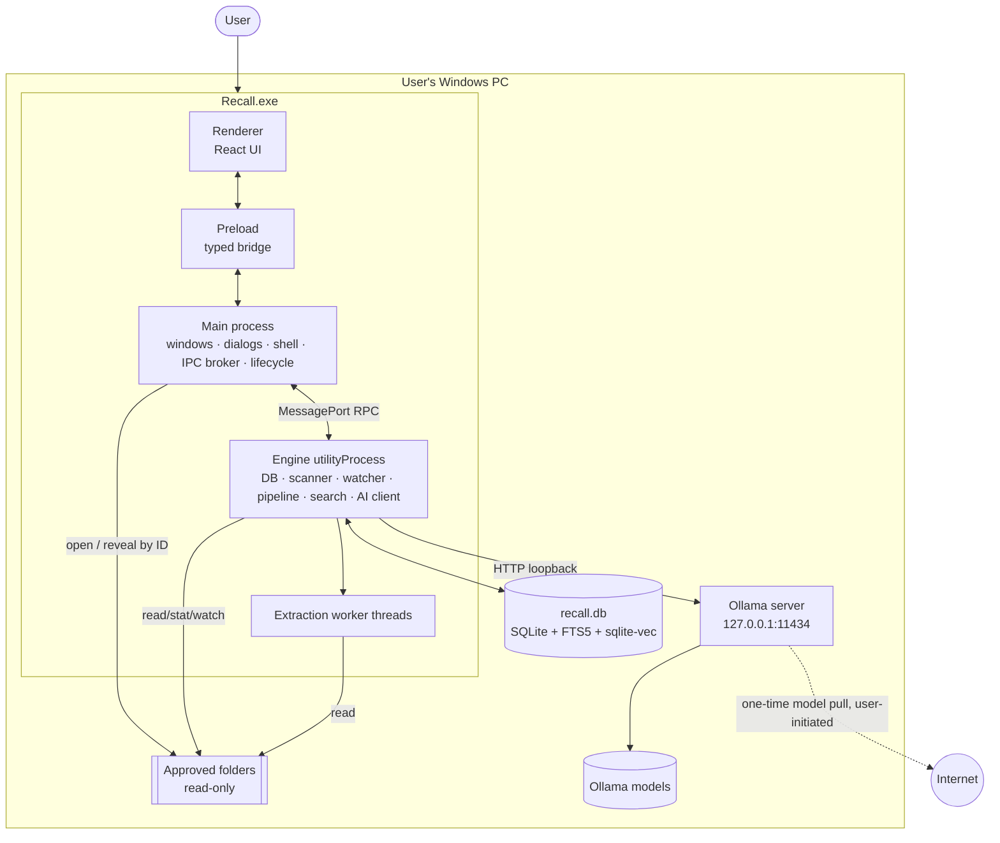
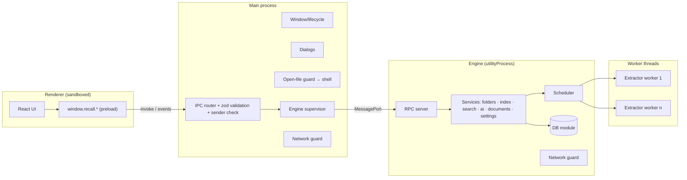
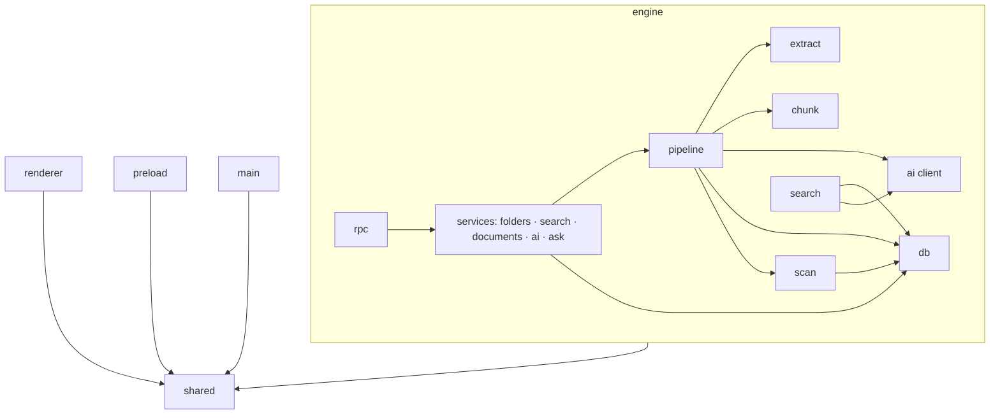
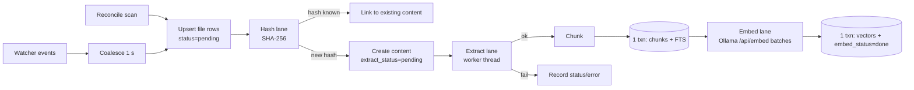
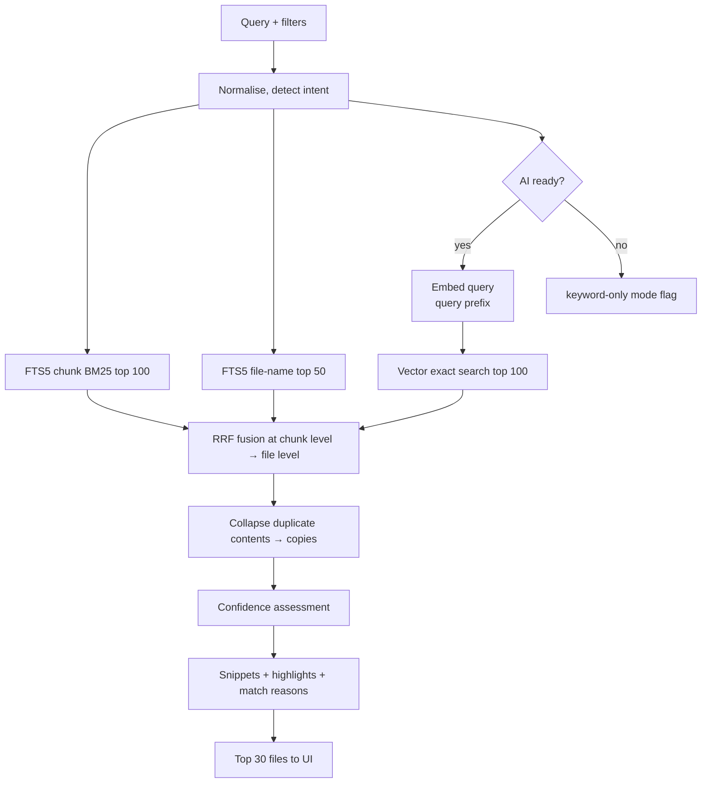

# 03 — System Architecture

> Status: **Draft for approval** · Related: [04 Retrieval](04-search-and-retrieval.md) · [05 Data model](05-data-model-and-indexing.md) · [06 Security](06-security-and-privacy.md)
>
> Version numbers below were **observed on 2026-10-09** from npm/GitHub/release pages (sources linked). They are pinned exactly at Stage 0 (S0-02) and re-verified then; nothing has been installed yet.

## 1. Decisions at a glance

| # | Question (from brief §9) | Decision | Confidence |
|---|---|---|---|
| 1 | Desktop runtime | **Electron** (latest stable at S0 — Electron 44 today, 45 due 2026-10-20) | High |
| 2 | Renderer framework | **React + Vite + TypeScript** (via `electron-vite`), not Next.js | High |
| 3 | Where the backend lives | Separate **engine process** (`utilityProcess`) — not the main process | High |
| 4 | Renderer ↔ services | `contextBridge` typed API → `ipcRenderer.invoke` → main validates (zod + sender) → engine via MessagePort RPC | High |
| 5 | Source of truth | **SQLite** (`better-sqlite3`), single file, engine is the only writer | High |
| 6 | Embeddings storage | Same SQLite DB; float32 BLOBs + **sqlite-vec** distance functions (exact search); `vec0` as upgrade path | Medium — validated by spike S0-05 |
| 7 | Keyword search | **SQLite FTS5** (BM25), external-content tables | High |
| 8 | Calling Ollama | Thin internal HTTP client (Node `fetch` + `AbortController`) to `127.0.0.1:11434`, with health monitor + circuit breaker | High |
| 9 | Extraction isolation | `worker_threads` pool inside the engine; per-file timeout + heap limit; pure-JS parsers; fixture-tested per extractor | High |
| 10 | Long-running jobs | State-driven scheduler in the engine (DB status columns are the queue), bounded concurrency, pause/resume, crash-safe | High |
| 11 | Surfacing errors | Typed `RecallError` codes → engine → main → renderer; each code maps to plain-language UI copy | High |
| 12 | Windows packaging | **electron-builder, NSIS per-user installer**; native files `asarUnpack`ed; fuses set; signing per decision D-07 | Medium |
| 13 | Testing without a model | `EmbeddingProvider`/`ChatProvider` interfaces with fake, recorded, and live implementations; fake Ollama HTTP server | High |
| 14 | Preventing network deps | Loopback-only network guard in main + engine, renderer CSP/webRequest blocking, OS firewall audit ([06 §8](06-security-and-privacy.md)) | High |

Shape: a **modular monolith** across three OS processes for isolation reasons (UI safety, UI responsiveness, crash containment) — not microservices. All business logic lives in one TypeScript codebase with internal interfaces.

## 2. System context



## 3. Technology choices

### 3.1 Desktop runtime — Electron

| Option | For | Against | Verdict |
|---|---|---|---|
| **Electron** | Node ecosystem for parsers/SQLite/watchers; mature Windows packaging; `utilityProcess` for background work; strong security guidance; team already scoped it | Large install (~100+ MB); Chromium memory overhead | **Chosen** |
| Tauri | Small binaries, Rust backend | Backend would be Rust (or a Node sidecar = two runtimes); JS document-parsing ecosystem not directly usable; slower for this team | Rejected |
| .NET / WinUI | Native Windows, Windows.Media.Ocr | Different language from all candidate libs; slower UI iteration | Rejected |
| Local web server + browser | Simple | No native dialogs/open-file integration; localhost server is an attack surface | Rejected |

Electron facts relied on (verified 2026-10-09): stable is 44.x (Chromium 152, Node 24.21.0); a new major every 8 weeks; the latest 3 majors are supported ([releases](https://releases.electronjs.org/), [timelines](https://www.electronjs.org/docs/latest/tutorial/electron-timelines)). Policy: stay within the supported window; upgrade one major at a time at stage boundaries.

### 3.2 Renderer — React + Vite (not Next.js)

Next.js' value (SSR, server components, file routing, API routes, image optimisation) doesn't apply in a desktop renderer that loads static local files and must have no server and no network. A static export would work but adds a framework whose defaults fight Electron's security model. **React 19 + Vite + TypeScript** gives HMR and a plain SPA. Build orchestration via **electron-vite** (5.0.0; separate main/preload/renderer builds, utility-process and worker entry support — [electron-vite.org](https://electron-vite.org/)). Forge's own Vite plugin is still marked experimental ([Forge docs](https://www.electronforge.io/config/plugins/vite)), which is why it is not chosen. Note: electron-vite 5.0.0 declares Vite ^5–^7 peer support — S0-02 pins a compatible Vite.

UI libraries: Tailwind CSS (styling), Radix UI primitives (accessible dialogs/menus/tabs/tooltips), `@tanstack/react-virtual` (long result lists and document text), `zustand` (small UI state). No router library in MVP — a handful of top-level views via state; revisit if deep links are needed.

### 3.3 Approved dependency list

Adding anything else follows the policy in [09 §7](09-team-and-workflow.md). Versions observed 2026-10-09; licences verified at install (S0-02).

| Package | Purpose | Process | Notes |
|---|---|---|---|
| `electron` | Runtime | — | Pin exact |
| `better-sqlite3` (13.x) | SQLite driver | engine | v13 is the first **Node-API** build — prebuilt binaries "should theoretically work" across Node and Electron ([releases](https://github.com/WiseLibs/better-sqlite3/releases)); bundles SQLite 3.53.x with FTS5 enabled ([compilation.md](https://github.com/WiseLibs/better-sqlite3/blob/master/docs/compilation.md)). **S0-03 verifies** the same binary loads under Node (Vitest) and Electron. |
| `sqlite-vec` (0.1.9, pinned) | Vector distance functions / `vec0` | engine | Pre-1.0; Windows x64 prebuilt via `sqlite-vec-windows-x64`; `getLoadablePath()` doesn't handle asar — Recall resolves `app.asar.unpacked` itself ([issue #194](https://github.com/asg017/sqlite-vec/issues/194)). Fork `@photostructure/sqlite-vec` handles this automatically — evaluated in S0-05. |
| `pdfjs-dist` (6.x, legacy build) | PDF text per page | extraction worker | Node usage requires `pdfjs-dist/legacy/build/pdf.mjs` ([FAQ](https://github.com/mozilla/pdf.js/wiki/Frequently-Asked-Questions)); password errors via `PasswordException`. Chosen over `unpdf` because unpdf bundles an older pdf.js (5.x). |
| `mammoth` (1.13.x) | DOCX → raw text (+ headings via HTML mode) | extraction worker | `.docx` only ([repo](https://github.com/mwilliamson/mammoth.js)) |
| `mdast-util-from-markdown` (2.x) | Markdown structure for heading-aware chunks | extraction worker | ESM-only |
| `chardet` (2.x) | Text encoding detection | extraction worker | zero deps |
| `@parcel/watcher` (2.x) | Recursive live file watching | engine | Native, ReadDirectoryChangesW on Windows, `win32-x64` prebuild; `ignore` globs ([repo](https://github.com/parcel-bundler/watcher)) |
| `zod` | IPC / settings / LLM-output schemas | all | |
| `pino` | Structured logs (with redaction) | main, engine | |
| `react`, `react-dom`, `tailwindcss`, `@radix-ui/*`, `@tanstack/react-virtual`, `zustand`, `clsx` | UI | renderer | |
| **Dev:** `typescript`, `vite`, `electron-vite`, `electron-builder`, `@electron/fuses`, `vitest`, `@playwright/test`, `@axe-core/playwright`, `fast-check`, `eslint`, `typescript-eslint`, `eslint-plugin-react`, `eslint-plugin-jsx-a11y`, `prettier` | Build/test | — | |
| **Later (approved in principle):** `tesseract.js` 7 (OCR, Stage 4, language data bundled — it fetches from a CDN by default, [local install docs](https://github.com/naptha/tesseract.js/blob/master/docs/local-installation.md)); `koffi` (if S0-07 picks FFI for file attributes); `diff` (Stage 5 compare) | | | |

Deliberately **not** used: LangChain/LlamaIndex (thin needs, heavy abstractions, network-capable integrations), an ORM (SQL is central and FTS/vector SQL is non-standard), the `ollama` npm client (a ~200-line internal client is easier to guard, fake, and abort), `chokidar` (5.x is fine, but `@parcel/watcher` coalesces events natively and handles large trees better on Windows).

### 3.4 Language & runtime versions

TypeScript (strict, ESM) everywhere. Tooling Node = the LTS installed on the dev machine (24.21.0 observed), which matches Electron 44's bundled Node 24.21.0 — engine code can therefore be unit-tested under plain Node with the same language features.

## 4. Process model



| Process | Owns | Must never |
|---|---|---|
| **Renderer** | UI state, rendering, keyboard handling | Access Node, the filesystem, or the network; construct paths for privileged operations |
| **Preload** | A frozen, typed `window.recall` API mapping 1:1 to declared IPC channels | Expose `ipcRenderer` or generic `invoke(channel)` |
| **Main** | Window lifecycle, native dialogs, `shell` calls (open/reveal/trash in Stage 7), clipboard, power events, engine supervision, IPC validation, single-instance lock | Open the database; do CPU-heavy work; parse documents |
| **Engine** | Database (sole connection owner), scanning, watching, scheduling, embedding/chat client, search, document reads, GC | Touch Electron UI APIs; talk to the renderer except through main |
| **Extraction workers** | Parsing one file at a time into text + structure | Write to the DB; make network calls |

**Why the engine is not in main:** indexing is CPU- and I/O-heavy (PDF parsing, hashing, synchronous SQLite) and would stall main's event loop, freezing window management and IPC (NFR-08). A separate process also contains crashes: a parser bug that kills the engine is restarted by the supervisor while the UI stays up. Electron documents `utilityProcess` for "CPU intensive tasks or crash prone components" and supports MessagePorts ([utility-process API](https://www.electronjs.org/docs/latest/api/utility-process)). Native module use inside a utility process is expected (it exposes "all of Node.js APIs") but is **explicitly verified in S0-03**.

**Why extraction uses worker threads (not more processes):** pdf.js and mammoth are pure JS; `worker.terminate()` plus `resourceLimits` bounds hangs and memory without process-spawn overhead. If Stage 0/1 finds a parser that can crash the process natively, extraction moves to a second utility process behind the same interface.

## 5. Modules and interfaces

### 5.1 Folder structure

```
recall/
├─ docs/app-plan/ · docs/adr/ · docs/user/ · docs/validation/
├─ src/
│  ├─ shared/                     # imported by all targets; no Node/DOM-specific code
│  │  ├─ ipc/contract.ts          # channel names + zod request/response/event schemas
│  │  ├─ errors.ts                # RecallError codes + user-message keys
│  │  ├─ settings.ts              # typed settings registry + defaults
│  │  └─ types.ts                 # DTOs (SearchResult, FolderStatus, AiReadiness, …)
│  ├─ main/
│  │  ├─ index.ts                 # app lifecycle, single-instance, window creation
│  │  ├─ security/                # CSP, navigation/permission handlers, protocol, network-guard bootstrap
│  │  ├─ ipc/router.ts            # registers handlers from contract; validation; sender checks
│  │  ├─ engine/supervisor.ts     # spawn utilityProcess, RPC client, restart w/ backoff
│  │  ├─ files/open-guard.ts      # open/reveal/copy-path by fileId
│  │  ├─ dialogs.ts · power.ts · paths.ts
│  │  └─ testing/hooks.ts         # E2E stubs (excluded from production build)
│  ├─ preload/index.ts            # contextBridge: window.recall API
│  ├─ renderer/
│  │  ├─ app/ (shell, rail, status bar, banners)
│  │  ├─ features/{onboarding,search,document,folders,settings,ask,discover}/
│  │  ├─ components/ (Radix-based primitives)
│  │  └─ lib/ (api client wrapper, keyboard, formatting)
│  └─ engine/
│     ├─ index.ts                 # utilityProcess entry: guard → DB → services → RPC
│     ├─ rpc/                     # message framing, request routing, cancellation
│     ├─ db/ (connection.ts, migrations/, repositories/)
│     ├─ folders/ (service, path-rules, exclusions)
│     ├─ scan/ (walker, reconcile, watcher, attributes)
│     ├─ pipeline/ (scheduler, hash, extract-pool, chunk, embed, gc)
│     ├─ extract/ (worker.ts, extractors/{text,markdown,code,pdf,docx}.ts, registry.ts)
│     ├─ chunk/ (chunker.ts, strategies/)
│     ├─ ai/ (ollama-client.ts, health.ts, readiness.ts, providers/{embedding,chat}.ts)
│     ├─ search/ (query.ts, keyword.ts, vector.ts, fusion.ts, grouping.ts, snippets.ts, confidence.ts)
│     ├─ documents/ (detail, stitching)
│     ├─ ask/ (Stage 6: retrieve, prompt, validate)
│     ├─ discover/ (Stage 5)
│     └─ common/ (logger, network-guard, clock, errors)
├─ tests/ (unit/, integration/, e2e/, fixtures/, eval/{corpus,queries.jsonl,qa.jsonl,recorded-embeddings/})
├─ scripts/ (eval.ts, bench.ts, audit-network.ts, make-fixtures.ts)
└─ electron.vite.config.ts · electron-builder.yml · tsconfig.*.json · vitest.config.ts · playwright.config.ts
```

### 5.2 Key internal interfaces

These are the seams that make the engine testable and replaceable. (Described, not coded.)

| Interface | Responsibility | Implementations |
|---|---|---|
| `EmbeddingProvider` | `info()` → model id, digest, dims, prefixes, max tokens; `embedDocuments(texts[], signal)`; `embedQuery(text, signal)` | `OllamaEmbeddingProvider`, `FakeEmbeddingProvider`, `RecordedEmbeddingProvider` |
| `ChatProvider` (Stage 6) | `generate(messages, schema, signal)` → stream of tokens / final JSON | `OllamaChatProvider`, `FakeChatProvider` |
| `AiRuntime` | `probe()` → not_installed / stopped / running(version); `listModels()`; `pull(model, onProgress, signal)`; `start()` | `OllamaRuntime`, fake |
| `Extractor` | `canHandle(ext, sniffedType)`; `extract(path, limits)` → `{ text, blocks[{kind, text, charStart, page?, headingPath?}], meta, warnings }` | One per format; registry selects |
| `Chunker` | `chunk(extracted, embeddingInfo)` → chunks with offsets/pages/sections | Strategy per kind |
| `KeywordIndex` | Insert/delete chunk text; `search(query, filters, k)` → ranked chunk ids + BM25 | FTS5 |
| `VectorIndex` | `upsert(spaceId, chunkId, vec)`, `deleteByContent`, `knn(spaceId, vec, k, filters)` | `SqlBlobVectorIndex` (default), `Vec0VectorIndex` (alt) |
| `FileSystemPort` | `walk`, `stat`, `readStream`, `attributes`, `watch` | Node impl; temp-dir based in tests |
| `Clock`, `Logger` | Time and logging | Real, fake |

### 5.3 Module dependencies (allowed directions)



Rules: `shared` imports nothing from other targets; renderer never imports engine/main code; engine never imports `electron` except the `utilityProcess` parent-port glue in `engine/rpc`; enforced by ESLint `no-restricted-imports`.

## 6. Long-running work: the scheduler

The engine runs a single **scheduler** that loops over *lanes*, each pulling work from DB state ([05 §5](05-data-model-and-indexing.md)):

| Lane | Picks | Concurrency (Balanced) | Notes |
|---|---|---|---|
| scan | folders needing reconcile | 1 | Walks are I/O-bound; one at a time avoids disk thrash |
| hash | `files.status='pending'` | 2 | Streaming SHA-256 |
| extract | `contents.extract_status='pending'` | `clamp(cpus/4, 1, 3)` workers | Timeout 60 s, heap cap 512 MB (tunable) |
| embed | `extract_status='ok' AND embed_status='pending'` | 1 in-flight batch | Batch size from S0 benchmark (start 16 chunks); paused when AI unavailable |
| gc | orphaned contents, vacuum | 1, idle only | |

- **Priority:** user-triggered work (retry, re-index file from detail view) jumps the queue; scan > hash > extract > embed so keyword search coverage grows first.
- **Pause/resume:** a scheduler flag; in-flight units finish (or are aborted for long embeds) and nothing new is taken. Persisted in settings so pause survives restart.
- **Backpressure:** lanes take small batches (e.g. 20 rows) and re-query; no unbounded in-memory queues.
- **Throttle modes:** Low / Balanced / Fast adjust concurrency and add small sleeps between units (Stage 4 adds "pause on battery").
- **Progress events:** counts by status computed with indexed queries at most every 250 ms, pushed engine → main → renderer.
- **Search vs indexing:** writes are short transactions (per content), so searches interleave. If benchmarks show vector scans blocking the engine loop during heavy indexing, search moves to a read-only connection on a dedicated worker thread (WAL allows concurrent readers) — the `SearchService` interface doesn't change.

## 7. Error handling

**Taxonomy** (`src/shared/errors.ts`): every error crossing a process boundary is a `RecallError { code, retryable, userMessageKey, detail? }`. `detail` is developer-only and redacted.

| Family | Codes (examples) | Handling |
|---|---|---|
| File | `FILE_LOCKED`, `FILE_ACCESS_DENIED`, `FILE_VANISHED`, `FILE_TOO_LARGE`, `FILE_PLACEHOLDER` | Per-file status; retry policy per code; never aborts a batch |
| Extraction | `EXTRACT_PASSWORD`, `EXTRACT_CORRUPT`, `EXTRACT_NO_TEXT`, `EXTRACT_TIMEOUT`, `EXTRACT_UNSUPPORTED` | Content status; retry only `TIMEOUT`/unknown (max 3) |
| AI | `AI_NOT_INSTALLED`, `AI_UNREACHABLE`, `AI_MODEL_MISSING`, `AI_TIMEOUT`, `AI_BAD_RESPONSE`, `AI_DIMENSION_MISMATCH`, `AI_OUT_OF_MEMORY` | Circuit breaker → AI status; embedding lane pauses; search falls back to keyword-only |
| DB | `DB_CORRUPT`, `DB_FULL`, `DB_MIGRATION_FAILED`, `DB_NEWER_VERSION` | Blocking screens ([02 §5.13](02-ux-and-user-flows.md)); rebuild / restore backup |
| IPC | `IPC_INVALID`, `IPC_FORBIDDEN`, `ENGINE_RESTARTING` | Renderer shows retry; invalid payloads logged as security events (no payload contents) |
| Search | `SEARCH_CANCELLED` (silent), `SEARCH_FAILED` | Retry; keyword fallback |

**Ollama circuit breaker:** after 3 consecutive connection failures or timeouts → `AI_UNREACHABLE`; health probe (`GET /api/version`, 2 s timeout) with backoff 2 s → 30 s; on success → resume embedding lane, notify UI. A digest change detected via `/api/tags` → treated as model change ([05 §8](05-data-model-and-indexing.md)).

**Engine supervisor:** on unexpected exit, restart with backoff (1 s, 5 s, 20 s); > 3 crashes in 5 min → stop, show banner with *Restart indexer* and *Export diagnostics*. Pending RPCs reject with `ENGINE_RESTARTING`; the renderer retries idempotent reads automatically.

Unhandled exceptions/rejections in any process are logged (redacted) and, in the engine, cause a controlled exit so the supervisor restarts from a clean state.

## 8. Packaging and installation (Windows)

| Topic | Decision |
|---|---|
| Builder | **electron-builder**, NSIS target. Rationale: per-user install without admin, configurable uninstaller (incl. "remove app data" option), mature `asarUnpack`, built-in `@electron/fuses` support; Azure Trusted Signing supported via `win.azureSignOptions`. Electron's docs recommend Forge, whose Windows makers are Squirrel/WiX/AppX/MSIX — viable alternative, recorded in ADR-012. |
| Install scope | Per-user (`%LOCALAPPDATA%\Programs\Recall`), no admin rights |
| Native assets | `asarUnpack`: `**/*.node`, `**/*.dll` (better-sqlite3, sqlite-vec, @parcel/watcher, later koffi); extension path resolved to `app.asar.unpacked` at runtime |
| Fuses | As in [06 §5](06-security-and-privacy.md); separate E2E test build |
| Signing | Decision **D-07**: unsigned builds show a full SmartScreen warning; OV certificates no longer bypass SmartScreen; Azure Trusted Signing is the cheapest route but limited to some countries ([Electron code signing](https://www.electronjs.org/docs/latest/tutorial/code-signing)). MVP for hackathon/demo can ship unsigned with documented steps. |
| Auto-update | **None in MVP** (avoids a network dependency). Later opt-in via `electron-updater` (NSIS) — decision D-12. |
| Ollama | **Not bundled** in MVP (D-01). Onboarding detects/guides. |
| Smoke test | Packaged exe supports `--smoke-test`: opens a temp DB, loads sqlite-vec, runs migrations, one FTS + one vector query on a bundled sample, exits 0. Run after every `npm run package`. |
| Uninstall | App files removed; NSIS page asks whether to remove Recall data (DB, logs). Ollama and its models are never touched. |

## 9. Architecture decision records (initial)

To be written as files in `docs/adr/` during S0-01; listed here as the canonical summary.

| ADR | Decision | Key alternative(s) | Revisit if |
|---|---|---|---|
| ADR-001 | Electron desktop runtime | Tauri, .NET | Install size becomes a blocker |
| ADR-002 | React + Vite (electron-vite), no Next.js | Next.js static export, Forge Vite plugin | electron-vite unmaintained |
| ADR-003 | Engine in `utilityProcess`; main is a thin broker | Engine in main; hidden BrowserWindow; `child_process` | utilityProcess can't load a required native module (S0-03) |
| ADR-004 | SQLite (better-sqlite3 13) as single source of truth | `node:sqlite` (still Stability 1.2 RC in Node 24 docs), LanceDB | better-sqlite3 N-API build fails in Electron |
| ADR-005 | Content-addressed storage (files → contents → chunks) | Path-keyed chunks | — |
| ADR-006 | Vectors as BLOBs + sqlite-vec scalar distance, exact search | `vec0` table; LanceDB; hnswlib; JS brute force | S0-05 latency over budget → `vec0`; > 1M vectors → ANN |
| ADR-007 | FTS5 BM25 for keyword + file-name search | Custom inverted index; MiniSearch | — |
| ADR-008 | Reciprocal Rank Fusion as baseline hybrid | Weighted score blending | Eval shows a learned/weighted blend wins |
| ADR-009 | Ollama via thin HTTP client, loopback-only | Official `ollama` client; node-llama-cpp in-process | D-01 decides to bundle a runtime |
| ADR-010 | DB state as work queue (no job table) | Persistent job queue | Need for scheduled/recurring heterogeneous jobs |
| ADR-011 | Extraction in worker threads with limits | Separate process | Native-crash-prone parser added |
| ADR-012 | electron-builder NSIS per-user | Forge + Squirrel/MSIX | Store distribution required (MSIX) |
| ADR-013 | Loopback-only network policy + guard | Trust-based | — |

## 10. IPC contract (MVP)

All channels are declared in `src/shared/ipc/contract.ts` with request/response schemas. Requests are `invoke` (promise); pushes are events. File references are always `fileId` / `folderId`.

| Channel | Request | Response | Notes |
|---|---|---|---|
| `app.getStatus` | — | index counts, AI status, paused, offline | |
| `onboarding.complete` | — | ok | |
| `ai.getReadiness` | — | `AiReadiness` | |
| `ai.startRuntime` | — | ok / error | Launches installed Ollama app only |
| `ai.pullModel` / `ai.cancelPull` | `{model}` (must be in vetted list) | ok | Progress via `ai.pullProgress` event |
| `folders.list` | — | `FolderStatus[]` | |
| `folders.add` | — | `FolderStatus` or cancelled | **Main** opens the dialog; renderer never sends a path |
| `folders.remove` · `folders.rescan` · `folders.rebuild` | `{folderId}` | ok | |
| `folders.setExclusions` | `{folderId, patterns[]}` (validated globs, length caps) | ok | |
| `indexing.pause` · `indexing.resume` | — | ok | |
| `indexing.retry` | `{fileIds?: number[], all?: true}` | count | |
| `failures.list` | `{folderId?, cursor?}` | page of failures | |
| `search.query` | `{requestId, q (≤ 500 chars), filters?, limit ≤ 100}` | `SearchResponse` | Previous request with same view is cancelled |
| `search.cancel` | `{requestId}` | ok | |
| `documents.get` | `{fileId, cursor?}` | metadata + stitched text page + match offsets | |
| `files.open` · `files.reveal` · `files.copyPath` | `{fileId}` | ok / `RecallError` | Open-file guard ([06 §5.1](06-security-and-privacy.md)) |
| `settings.get` · `settings.update` | patch validated by registry | settings | |
| `data.getUsage` · `data.deleteAll` | — / `{confirm:"DELETE"}` | usage / ok | |
| `diagnostics.export` | — | ok (save dialog in main) | Redacted |
| `app.reportRendererError` | `{code, component, stackHash}` | ok | Renderer errors reach the main log without message text or data |
| Events | `status.changed`, `indexing.progress`, `ai.changed`, `ai.pullProgress`, `engine.restarted` | | Throttled |

Main ↔ engine uses the same DTO schemas over a MessagePort with `{id, method, params}` / `{id, result | error}` / `{event, data}` framing and supports cancellation messages.

## 11. Ollama integration

| Concern | Design |
|---|---|
| Endpoint | Default `http://127.0.0.1:11434`; only port editable; host must be loopback (validated before every call). |
| Calls | `GET /api/version` (probe), `GET /api/tags` (models + digests), `POST /api/show` (model details), `POST /api/embed` (batch embeddings), `POST /api/pull` (streamed progress), `POST /api/chat` (Stage 6, streamed, JSON-schema `format`). Details and verified request shapes in [04 §5](04-search-and-retrieval.md). |
| Timeouts | Probe 2 s; embed batch 120 s for the first call after idle (model load), 60 s afterwards; chat first token 60 s. All abortable via `AbortController`. |
| Concurrency | One embedding request in flight from the indexer; query embeddings bypass the indexer queue (separate in-flight slot) so searches aren't stuck behind a batch. |
| Warm-up | When AI is ready and the search box gains focus, fire a tiny embed request to load the model; `keep_alive` set while indexing and for a configurable time after (default 10 min). |
| Embedding calls | `truncate: false` always (Ollama's default silently truncates); verify returned count and dims; vectors are documented as L2-normalised. |
| Chat calls (Stage 6) | Always set `options.num_ctx` (default context is 4,096 tokens on < 24 GiB VRAM — [docs](https://docs.ollama.com/context-length)); `think: false` or non-thinking model variants. |
| Starting Ollama | "Start Ollama" launches the installed Ollama desktop app from its standard per-user install location (the Windows installer needs no admin and installs under the user's home — [Windows docs](https://docs.ollama.com/windows); exact executable path verified in S0-04); never installs, configures, or modifies it. |
| Not installed | Detected when the endpoint is down and no installation is found → guidance screen. |
| Model download | Only models in Recall's vetted list; explicit consent dialog states it uses the internet; progress from the `/api/pull` stream (`status`, `digest`, `total`, `completed`); cancellable; Ollama resumes cancelled pulls. |
| **Cloud models** | Ollama can serve *cloud* models through the same local API (requests forwarded to ollama.com). Recall **rejects any model that is not local**: vetted list only, plus a check of the model's details/capabilities from `/api/show` and name conventions (e.g. `-cloud` tags) — exact detection rule verified in S0-04. Users who want belt-and-braces can set `OLLAMA_NO_CLOUD=1` ([FAQ](https://docs.ollama.com/faq)); Recall's help explains this but never changes Ollama's configuration. |
| Ollama's own network use | The Ollama Windows tray app checks for and downloads its own updates from ollama.com. That is Ollama's behaviour, outside Recall's process boundary; Recall's offline claim covers Recall's processes and the workflows in [07 §8](07-testing-and-acceptance.md), and the privacy page says so plainly. |

## 12. Data flows

### 12.1 Indexing



### 12.2 Search



Details of each step: [04](04-search-and-retrieval.md).

## 13. Testability and network safety (summary)

- The engine can be started **headless** under plain Node (no Electron) with a `FileSystemPort`, `EmbeddingProvider`, and DB path — this is how integration tests, the eval harness, and benchmarks run ([07](07-testing-and-acceptance.md)).
- No test in `npm test` touches the network; the network guard runs in `fail` mode in all test processes, so an accidental remote call fails the suite.
