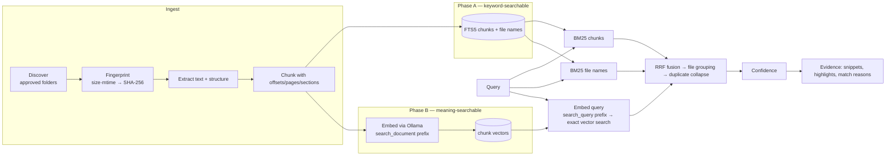
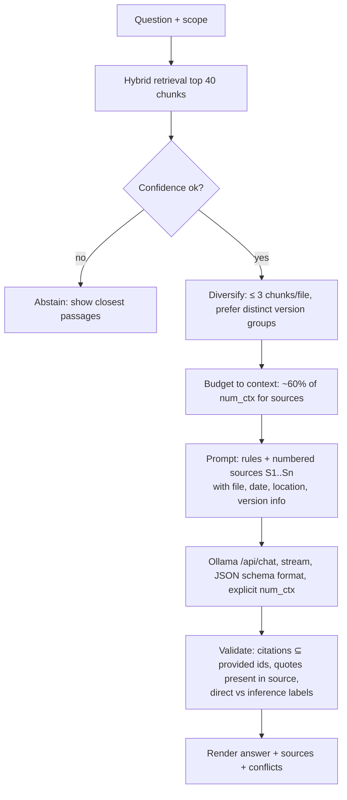

# 04 — Search and Retrieval Engine

> Status: **Draft for approval** · Related: [03 Architecture](03-system-architecture.md) · [05 Data model](05-data-model-and-indexing.md) · [07 Testing §5](07-testing-and-acceptance.md)
>
> Parameter values in this document (chunk sizes, candidate counts, RRF k, thresholds) are **starting points**, chosen from common practice and model constraints. Each is tuned with the evaluation harness; none is claimed to be optimal.

## 1. Pipeline overview

**Two-phase indexing** is a deliberate product choice: extraction + FTS are fast and need no model, so the whole corpus becomes keyword-searchable early and stays searchable when Ollama is unavailable. Embedding (the slow phase on CPU) fills in behind it.

## 2. Ingestion

### 2.1 Supported formats

| Kind | Extensions (MVP) | Extractor | Structure captured | Stage |
|---|---|---|---|---|
| text | `txt log` | Encoding detection (`chardet`) → decode | Paragraphs | MVP |
| markdown | `md markdown mdx` | `mdast-util-from-markdown` | Heading tree → `section_path`; paragraphs, lists, code blocks | MVP |
| code / structured text | `js jsx ts tsx mjs cjs py java cs go rs rb php kt swift c h cpp hpp sql sh ps1 bat html css scss json yaml yml toml ini xml csv` | Text decode | Line numbers; blank-line-separated blocks; simple heuristic symbol names (function/class lines) for `section_path` | MVP |
| pdf | `pdf` | `pdfjs-dist` legacy build: `getTextContent()` per page | Page numbers; line/paragraph reconstruction from text items | MVP |
| docx | `docx` | `mammoth` (HTML conversion to recover headings, then text) | Headings → `section_path`; paragraphs; tables as tab-separated rows | MVP |
| image (OCR) | `png jpg jpeg webp bmp tiff` | `tesseract.js` (bundled `eng` data; more languages optional) | Lines; confidence | Stage 4 (opt-in) |
| scanned PDF (OCR) | PDF pages with no text layer | Render page (pdf.js + `@napi-rs/canvas`) → OCR | Page numbers | Stage 4 (opt-in) |
| pptx / xlsx / odt / rtf / eml | — | Candidates: `officeparser` (one dependency covering many formats — pulls in pdfjs-dist + tesseract.js, so evaluated for weight) | Slides / sheets | Stage 5+ backlog, by user demand |

Note: `.ps1`, `.bat`, `.js` etc. are *indexed as text* (useful for developers) but never *launched* by Recall ([06 §5.1](06-security-and-privacy.md)).

Format detection uses the extension, then **sniffs magic bytes** (`%PDF-`, ZIP `PK\x03\x04` for DOCX) to catch mislabelled files. Content that fails the sniff is recorded as `unsupported`/`corrupt` rather than fed to the wrong parser.

**Skip rules** (applied before reading content where possible): built-in excluded directories (`.git`, `node_modules`, `bin`/`obj` under code projects, `dist`, `build`, `.venv`, `__pycache__`, `$RECYCLE.BIN`, `System Volume Information`); hidden/system attribute files; Office lock files (`~$*`); size caps (50 MB default, PDFs 200 MB); binary detection for text kinds (NUL byte in first 8 KB); minified detection for code (very long average line length); cloud placeholders ([05 §6.4](05-data-model-and-indexing.md)).

### 2.2 Extraction contract

Each extractor returns `{ text, blocks[], meta, warnings[] }` where `text` is the normalised full text and each block carries `{kind: heading|paragraph|list|table|code|page_break, charStart, charEnd, page?, headingPath?}`. Normalisation: Unicode NFC; line endings → `\n`; collapse runs of > 2 blank lines; strip control characters except `\n\t`; PDF: join hyphenated line breaks and reflow lines into paragraphs using text-item geometry (heuristic, fixture-tested). Offsets always refer to the normalised `text`.

Metadata normalisation into `contents.meta`: title (DOCX core properties / PDF info dictionary / first H1), author if present, page count, warnings (`textlessPages`, `truncated`, `ocrConfidence`).

Limits enforced inside the worker: max extracted characters per file (default 2 M chars; beyond that → index the first part and record `truncated`), per-file timeout, heap cap, DOCX decompressed-size cap.

### 2.3 Fingerprints and incremental processing

Size + mtime decide whether to re-read; SHA-256 of bytes decides identity ([05 §6](05-data-model-and-indexing.md)). Identical bytes are extracted and embedded once regardless of how many paths reference them. Extractor and chunker versions are stored per content so improvements re-process lazily.

## 3. Chunking

### 3.1 Strategy

Structure-first, size-second:

1. Split at **hard boundaries**: Markdown/DOCX headings up to level 3 start a new chunk; PDF chunks may span a page break but record `page_start`/`page_end`; code splits at blank-line-separated top-level blocks.
2. Within a section, **pack blocks** (paragraphs, list items, table rows) until the target size is reached; never split inside a sentence unless a single sentence exceeds the maximum (then split at the nearest whitespace).
3. Add **overlap** by repeating the trailing sentence(s) of the previous chunk (≈ 15% of target), only within the same section.
4. Tiny trailing chunks (< min size) merge into the previous chunk.

### 3.2 Parameters (starting values)

| Parameter | Prose | Code | Rationale |
|---|---|---|---|
| Target size | ~1,200 chars (≈ 300 tokens) | ~60 lines or 1,600 chars | Small enough that a passage is a meaningful "evidence" unit; large enough for embedding context |
| Max size | 2,400 chars | 2,400 chars | Keeps every chunk far below the embedding context limit (below) |
| Min size | 200 chars | 5 lines | Avoid noise chunks |
| Overlap | ~180 chars (whole sentences) | 5 lines | Preserve continuity across boundaries |

**Hard cap from the model:** the Ollama library page for `nomic-embed-text` lists a 2K-token context (the HF card advertises 8192 with scaling; the effective value under Ollama is **unverified** and checked via `/api/show` in S0-04). Recall therefore budgets chunks against 2,048 tokens with a conservative 3 chars/token estimate (≈ 6,000 chars), and sends embeddings with `truncate: false` so an oversized input **fails loudly** instead of being silently cut (Ollama's default `truncate: true` cuts the end of the input — [API docs](https://github.com/ollama/ollama/blob/main/docs/api.md)). On a context-length error the chunk is split in half and retried.

Experiments (S1-11, S4): target 800 / 1,200 / 2,000 chars; overlap 0 / 15%; heading-bounded vs. fixed windows.

### 3.3 Contextual header for embeddings

The text sent for embedding is: `search_document: {title} › {section_path}\n\n{chunk text}` — the prefix is required by nomic-embed-text; the title/section line is a cheap way to give a passage its document context. The header uses only **content-intrinsic** information (document title, headings) — not the file name — because one content can be referenced by several files with different names. File names are matched by the separate file-name list (§4.3). The header is not stored in `chunks.text`, so offsets and evidence display stay exact. Header on/off is evaluated in S1-11.

### 3.4 Mapping back to originals

Every chunk stores `char_start/char_end` (in normalised text), `page_start/page_end` (PDF), and `section_path`. The UI shows "p. 4" or "§ Payment terms"; the detail view stitches chunks to show full text and scroll to the passage. Opening the original file at a specific page is not supported generically on Windows in MVP (PDF viewers differ); the evidence pane provides the location label instead.

## 4. Keyword search (FTS5)

### 4.1 Index

`chunks_fts` (external content on `chunks`) with `unicode61 remove_diacritics 2` ([SQLite FTS5](https://www.sqlite.org/fts5.html)). Evaluated variants: `porter unicode61` (stemming: "payments" ↔ "payment"), and in Stage 4 a `trigram` index on file names and code chunks for substring/identifier matches (trigram requires ≥ 3-char terms).

### 4.2 Query construction

User text is **never** passed to FTS5 MATCH raw (FTS syntax characters would error or change meaning). The engine tokenises the query with the same rules, drops a small English stopword list (only for the keyword list; the full query still goes to the embedder), and builds `"t1" OR "t2" OR …` with each token quoted. BM25 naturally ranks chunks that match more and rarer terms higher. If the query contains a quoted phrase, that phrase is added as a phrase term. Numbers are kept (`50%` → `50`); this is why the evidence highlighting and the eval set include numeric queries.

Ranking: `bm25(chunks_fts)` (lower is better). Candidate count `K_kw = 100` chunks.

### 4.3 File-name list

`files_fts(name, rel_path)` queried with the same tokens; `bm25` with name weighted above path (e.g. `bm25(files_fts, 5.0, 1.0)` — starting value). Candidate count `K_name = 50` files. This is what makes "the Acme proposal" find `Acme_Proposal_v3.docx` even if its body never says "Acme". File-name tokens split on `_`, `-`, `.`, camelCase (pre-processed into a tokenised column at insert time).

## 5. Embeddings

### 5.1 Model

| | Default (provisional) | Notes |
|---|---|---|
| Model | **`nomic-embed-text` (v1.5)** via Ollama | 137M params, F16, 274 MB download, Apache-2.0, 768 dims, Matryoshka (768/512/256/128/64) — [Ollama](https://ollama.com/library/nomic-embed-text:v1.5), [HF card](https://huggingface.co/nomic-ai/nomic-embed-text-v1.5) |
| Prefixes | `search_document: ` for chunks; `search_query: ` for queries | Required by the model; **Ollama does not add them** — Recall must |
| Status on dev machine | **Not downloaded** (checked 2026-10-09: only `qwen2.5:3b` present) | Pull is part of S0-04 *after plan approval* |

**Stage 0 bake-off (S0-06)** on the eval corpus, measuring Recall@10/MRR and CPU throughput: `nomic-embed-text` vs `qwen3-embedding:0.6b` (Apache-2.0, up to 1024 dims, 32K context, instruction prefix on queries) and, if its licence is confirmed on a primary source, `embeddinggemma-2` (new in the library this month; Apache-2.0 per press reports only). `embeddinggemma:300m` is excluded by default because it uses the Gemma Terms of Use (licence review needed, D-04). Vendor-reported MTEB scores exist for these models but are not comparable to Recall's task and are not used for the decision. **Rule:** keep nomic unless another model improves hybrid Recall@10 by ≥ 0.05 at acceptable indexing throughput (≥ 50% of nomic's).

### 5.2 Ollama `/api/embed` usage

Verified from the [Ollama API docs](https://github.com/ollama/ollama/blob/main/docs/api.md) and [embeddings docs](https://docs.ollama.com/capabilities/embeddings):

- `POST /api/embed` with `{ model, input: string[], truncate: false, keep_alive }` → `{ embeddings: number[][] }`. Batch input is supported.
- Returned vectors are **L2-normalised** — cosine similarity = dot product. Recall still re-normalises defensively (cheap) and verifies `embeddings.length === input.length` and `dims` equals the space's dims.
- `/api/embeddings` is superseded — not used.
- A `dimensions` parameter exists (Matryoshka truncation) — not used in MVP; considered for storage reduction (§5.4).
- Batch size: starting value 16 chunks; S0 benchmark picks the throughput-optimal size on the dev machine.

### 5.3 Vector search

`VectorIndex.knn(spaceId, queryVec, k=100, filters)`:

- **Default implementation:** exact search over `chunk_vectors` using sqlite-vec's `vec_distance_cosine(vec, :q)` with `ORDER BY distance LIMIT k`, joined to chunks/contents/files for filters. Exact search means filters never reduce recall (no post-filter starvation).
- **Upgrade path:** sqlite-vec `vec0` virtual table (`MATCH :q AND k = :k`, metadata columns for filters) if S0-05 shows the default too slow at the target scale. The author's published benchmarks (2024, older hardware) put 100k vectors in the tens-to-~100 ms range for brute force depending on dimension ([sqlite-vec v0.1.0 post](https://alexgarcia.xyz/blog/2024/sqlite-vec-stable-release/index.html)); **Recall's own numbers are measured in S0-05**, not assumed.
- Beyond ~1M chunks, exact search becomes the bottleneck; sqlite-vec's ANN features (DiskANN/IVF) exist only in 0.1.10 alphas at the time of writing. Out of scope for MVP (A-02).

### 5.4 Storage reduction (Stage 4, only if needed)

Options, each measured with the eval harness for quality loss: Matryoshka truncation to 512/256 dims; int8 quantisation (4× smaller) with float rescoring of the top 100; binary quantisation + rescoring. Triggered only if DB size or latency measured at A-02 scale is a problem.

### 5.5 Caching, model changes, failures

- **Document embedding cache** = content addressing: identical content is embedded once; moves/renames never re-embed.
- **Query embedding cache:** in-memory LRU (100 entries) keyed by `(space, normalised query)`; cleared on model change; never persisted (privacy).
- **Model change / digest change:** new embedding space, background re-embed, atomic swap ([05 §8](05-data-model-and-indexing.md)).
- **Failures:** Ollama unreachable → lane paused (no attempts consumed), keyword search continues; per-batch errors → bisect batch to isolate a bad chunk; a chunk that fails alone 3× marks its content `embed_status=failed` (still keyword-searchable).

## 6. Retrieval and ranking

### 6.1 Candidate generation

For query *q* (≤ 500 chars) with optional filters *F*:

| List | Source | Size | Unit |
|---|---|---|---|
| L_kw | FTS5 BM25 on chunks, with *F* | 100 | chunk |
| L_vec | exact cosine on chunk vectors, with *F* (skipped in keyword-only mode) | 100 | chunk |
| L_name | FTS5 BM25 on file names/paths, with *F* | 50 | file |

### 6.2 Fusion: Reciprocal Rank Fusion (baseline)

**RRF** (Cormack, Clarke & Büttcher, SIGIR 2009): `score(d) = Σ_lists 1 / (k + rank_list(d))`, with `k = 60` as in the original paper. Chosen as the baseline because it needs no score calibration between BM25 (unbounded, corpus-dependent) and cosine (model-dependent distribution) — avoiding an invented weighting formula.

Procedure:

1. Chunk-level RRF over L_kw and L_vec → `chunkScore`.
2. Map chunks → content → file(s). File base score = **max** `chunkScore` among its chunks (baseline aggregation).
3. Add L_name contribution at file level: `+ 1/(k + rank_name)`.
4. Collapse files sharing one content into a single result (§6.4); keep up to 3 best chunks per result for evidence.
5. Sort; return top 30 files.

Experiments evaluated against this baseline (S1-11, S4-03): RRF k ∈ {10, 30, 60}; list weights (weighted RRF); aggregation `max` vs `max + 0.5·second` vs top-3 sum; candidate sizes 50/100/200; porter stemming; contextual header. A change is adopted only if it beats the baseline on the eval set per the decision rule in [07 §5.4](07-testing-and-acceptance.md).

### 6.3 Metadata filters

File type (by kind/extension), folder, modified-date range — applied as SQL predicates inside **each** candidate query, so every list is filtered before ranking. UI arrives in Stage 4; the engine supports filters from Stage 1 (needed by tests and eval).

### 6.4 Duplicates and versions

- **Exact duplicates** (same SHA-256): one result, "N copies", all paths listed in the evidence pane; the primary path shown is the most recently modified copy. MVP.
- **Near-duplicates / versions** (Stage 4): MinHash signatures over word 5-gram shingles of the extracted text + file-name stem similarity (strip `v2`, `final`, `copy`, `(1)`, dates). Files above a Jaccard threshold (tuned on fixture versions; starting 0.6) in related folders form a version group. Results show the best-matching member with "3 versions" and a newest-first list; the eval's version queries measure whether the *intended* version ranks first.

### 6.5 Confidence and no-match behaviour

Scores are not probabilities, so confidence is a **rule over observable signals**, calibrated on the eval set:

| Signal | Meaning |
|---|---|
| `s_vec` | Cosine similarity of the best chunk in the top file (semantic mode only) |
| `kw_cov` | Fraction of non-stopword query terms present in the top file's best chunk |
| `agree` | Top file appears in both L_kw and L_vec top 10 |

Initial rule: **low confidence** if `kw_cov < 0.5` **and** `s_vec < τ` **and not** `agree`. In keyword-only mode: low confidence if `kw_cov < 0.5`. **τ is not guessed**: the eval script computes the τ that meets the Stage 4 targets (negative-query flag rate ≥ 0.70, positive false-flag rate ≤ 0.10) on the tuning split, per embedding model (cosine distributions differ by model), and stores it with the embedding space. Until calibrated (Stage 1), the low-confidence UI is disabled rather than driven by an arbitrary number.

No-match: zero candidates in all lists → no-match state ([02 §5.6](02-ux-and-user-flows.md)).

### 6.6 Recency and temporal intent (Stage 4)

Recency is **not** blended into general ranking (a newer irrelevant file must not outrank an older relevant one). A small rule-based parser detects temporal intent:

- *Ordering words* ("latest", "newest", "most recent", "last version", "updated") → within the top 50 candidates, add a fourth RRF list ranked by `mtime` desc, and within version groups show newest first.
- *Explicit ranges* ("last week", "in March", "2025") → converted into a date filter, shown to the user as a removable filter chip.

Evaluated with the temporal query type ([07 §5.2](07-testing-and-acceptance.md)).

### 6.7 Optional reranking (post-MVP experiment)

A cross-encoder reranker over the top 30 chunks could improve precision, but it adds a model and CPU latency. Ollama has no documented rerank endpoint (only embed/chat/generate are documented); options would be an in-process ONNX reranker or an LLM-as-reranker (too slow on CPU for interactive search). **Deferred**; considered only if Stage 4 eval shows ranking headroom that fusion tuning can't close and latency budget allows.

## 7. Result presentation

| Element | Source | Rule |
|---|---|---|
| Evidence passage | Best chunk of the result | Keyword hit: window of ~300 chars centred on the densest cluster of matched terms (computed in engine from token offsets; FTS5 `snippet()` used as a cross-check). Vector-only hit: first ~300 chars of the chunk, trimmed to sentence boundaries. |
| Highlights | Engine returns `[start, end]` ranges of matched query terms (with stemming equivalence when porter is on) | Renderer wraps ranges in `<mark>` as text nodes — never HTML from the engine |
| Location | `page_start`/`section_path`/line numbers | "p. 4", "§ Payment terms", "lines 120–168" |
| Match reasons (chips) | Deterministic from list membership | "Contains 'initial payment', '50'" (L_kw) · "Similar meaning" (+ location) (L_vec rank ≤ 10) · "File name match" (L_name) · "2 copies" · (Stage 4) "Newest of 3 versions" |
| Metadata | `files` | Name, shortened path, modified date, type |
| Mode indicator | Search response | `hybrid` / `keyword only` (+ reason) |
| Uncertainty | §6.5 | "Closest matches — none are a strong match" |
| Debug (developer mode) | Ranks/scores per list | Never shown by default |

No LLM is involved in search or explanations in the MVP: explanations are factual statements about *why* a file was retrieved, which keeps search fast on CPU and avoids hallucinated justifications. An optional LLM "summarise why this matches" is a Stage 6 add-on, clearly labelled.

## 8. Evaluation-driven improvement

1. **S1:** build the harness and the 80-query set; record the **baseline** for keyword-only, semantic-only, hybrid (RRF k=60, max aggregation, 1,200-char chunks, header on).
2. Run the experiment grid (§3.2, §6.2) with recorded embeddings; adopt changes per decision rule; document each in `eval-results/` and, when adopted, in an ADR.
3. **S4:** expand to 160 queries (temporal, version, OCR); calibrate τ; tune version grouping; re-baseline.
4. Every retrieval-affecting PR includes before/after metrics ([09 §6](09-team-and-workflow.md)).

## 9. Ask your files — retrieval for grounded answers (Stage 6)

- **Model:** decision D-04. `qwen2.5:3b` (already pulled on the dev machine) is under the **Qwen Research License**, which is unsuitable as the default for a distributed product. Apache-2.0/MIT candidates for the Stage 6 bake-off: `qwen3:4b-instruct` (2.5 GB, Apache-2.0), `granite4:micro` (2.1 GB, Apache-2.0, RAG/tool oriented), `phi4-mini` (2.5 GB, MIT). Sizes from the Ollama library pages; quality on Recall's QA set is measured, not assumed.
- **Context:** Ollama's default context is 4,096 tokens on machines with < 24 GiB VRAM ([context length docs](https://docs.ollama.com/context-length)); Recall always sets `options.num_ctx` explicitly (starting 8,192, memory-checked) so sources aren't silently cut.
- **Conflicts/outdated sources:** the prompt includes each source's modified date and version-group membership; the schema requires a `conflicts[]` field; deterministic post-check flags when cited sources from the same version group disagree on numbers/dates.
- **Direct vs inference:** schema field per claim; claims labelled `direct` must include a short quote that Recall verifies is present in the cited source (normalised substring match); failing quotes demote the claim to `inference` with a warning.
- **Abstention:** low retrieval confidence → no LLM call; model may also return `insufficient_evidence: true`.
- **Cancellation:** abort the HTTP request; whether Ollama stops generation on disconnect is **unverified** in the docs — checked in S6-01.
- **Thinking models:** use non-thinking variants or set `think: false` to control latency.

## 10. Contextual discovery (Stage 5) — what needs what

| Capability | Mechanism | Needs LLM? | Needs new algorithm? |
|---|---|---|---|
| Related files | Content vector = normalised mean of chunk vectors; KNN over content vectors excluding self/duplicates/version group; boosted by same-folder | No | No (vectors exist) |
| Similar documents | Same as above, user-initiated from any file | No | No |
| Exact duplicates | SHA-256 | No | No (MVP) |
| Near-duplicates / versions | MinHash + filename stem similarity | No | Yes — MinHash (small, well-known) |
| Draft/version comparison | Text diff of extracted text (`diff` library), changed sections highlighted | No (optional LLM summary of changes) | Diff only |
| Project grouping | Folder hierarchy + agglomerative clustering of content vectors within top-level folders; user can rename/merge | No (optional LLM naming) | Yes — clustering (simple) |
| Connections notes ↔ proposals ↔ code | Related-files across kinds + shared rare terms (BM25 of distinctive terms) | No | No |
| Older decisions | Ask-your-files style retrieval with decision-phrase cues ("we decided", "agreed") + dates | Yes for synthesis; retrieval alone lists candidates | No |
| "Possibly forgotten" | Related + old `mtime` + not opened via Recall recently (only if opt-in history is on) | No | No |

Everything in Stage 5 is retrieval + metadata + two small algorithms (MinHash, clustering). The LLM is optional decoration (naming groups, summarising differences), never required.
