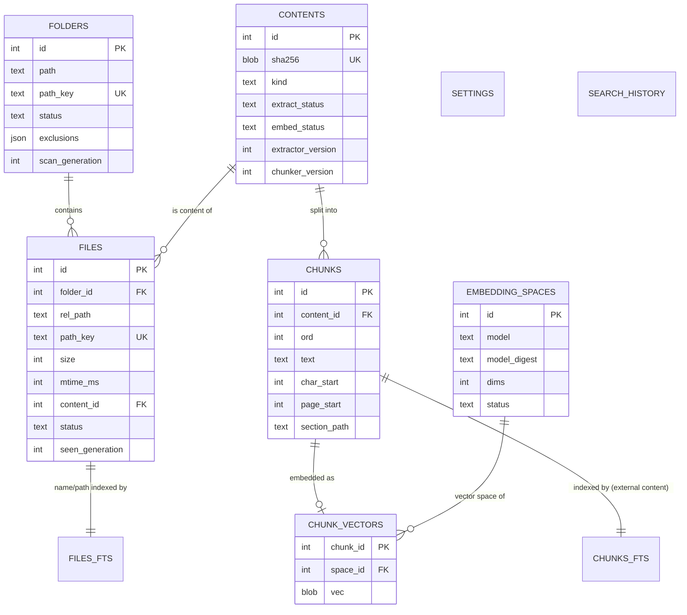
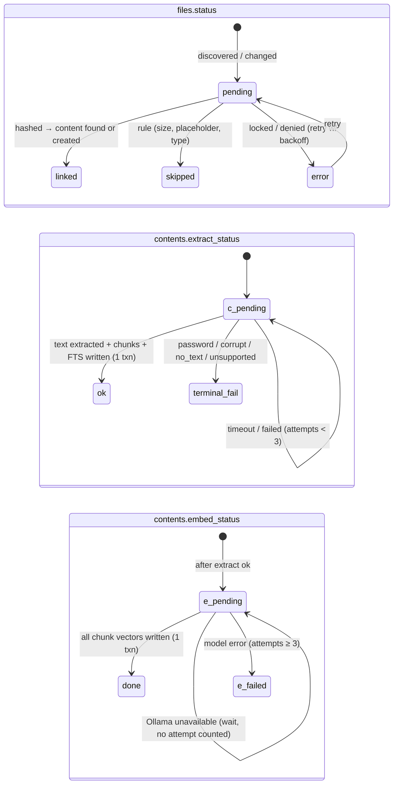

# 05 — Data Model and Index Lifecycle

> Status: **Draft for approval** · Related: [03 Architecture](03-system-architecture.md) · [04 Retrieval](04-search-and-retrieval.md) · [06 Security](06-security-and-privacy.md)

## 1. Principles

1. **SQLite is the single source of truth** for everything Recall knows. One database file, opened only by the engine process ([03 §4](03-system-architecture.md)).
2. **The index is regenerable.** Everything except settings (and opt-in history) can be rebuilt from the user's files + local models. This makes corruption recovery and schema upgrades safe: worst case is a rebuild, never data loss.
3. **Content is separated from location.** A *file* is a path; a *content* is a unique byte sequence (by SHA-256). Chunks and vectors belong to content. Renames, moves, and duplicate copies therefore never cause re-extraction or re-embedding.
4. **The database state is the work queue.** Pending work is expressed as status columns (`files.status`, `contents.extract_status`, `contents.embed_status`) rather than a separate job log. A crash loses only in-memory progress; on restart, pending rows are simply picked up again.
5. **No speculative entities.** No knowledge graph, no entity tables, no tags until a stage needs them (§9).

## 2. Storage location and files

| Item | Location | Notes |
|---|---|---|
| Database | `%LOCALAPPDATA%\Recall\data\recall.db` (+ `-wal`, `-shm`) | **Local**, not Roaming AppData: roaming profiles may sync `%APPDATA%` to servers, which would silently upload index contents. Electron's default `userData` is Roaming, so Recall sets the data path explicitly. |
| Pre-migration backups | `%LOCALAPPDATA%\Recall\data\backups\recall-v<N>-<timestamp>.db` | Keep last 2. Deleted by "Delete all data". |
| Logs | `%LOCALAPPDATA%\Recall\logs\` | Rotated, 5 × 5 MB; privacy rules in [06 §7](06-security-and-privacy.md). |
| Settings that must exist before the DB opens | `%LOCALAPPDATA%\Recall\config.json` | Only: data dir override, log level. Everything else in `settings` table. |
| Models | Managed by Ollama (its own models directory) | Recall never writes there. |

SQLite configuration (set at open): `journal_mode=WAL`, `synchronous=NORMAL` (safe with WAL; may lose the last transaction on power loss, never corrupts), `foreign_keys=ON`, `busy_timeout=5000`, `auto_vacuum=INCREMENTAL` (set at creation), `temp_store=MEMORY`, `mmap_size` tuned in Stage 0.

## 3. Entity overview

Entities considered and **not** introduced:
- **IndexingJob table** — replaced by status columns (principle 4). A job table would duplicate state that already lives on files/contents and create consistency problems (job says done, row says pending). Progress is computed with indexed `COUNT(*) … GROUP BY status` queries.
- **Separate full-text table** — the detail view reconstructs full text by stitching chunks via offsets (§4.4), avoiding storing the text twice.
- **Knowledge graph / entities** — not justified by any MVP use case.

## 4. Tables

Column types are SQLite affinities. Timestamps are integer milliseconds since epoch (UTC). Enumerations are `TEXT` with `CHECK` constraints.

### 4.1 `folders`

| Column | Type | Notes |
|---|---|---|
| `id` | INTEGER PK | |
| `path` | TEXT NOT NULL | Absolute path as the OS returned it (display). |
| `path_key` | TEXT NOT NULL UNIQUE | Normalised key: resolved, separators unified, trailing separator removed, **lower-cased** (Windows paths are case-insensitive). |
| `status` | TEXT | `active` · `paused` · `unavailable` (root missing) · `removing` |
| `exclusions` | TEXT (JSON array) | User glob patterns, in addition to built-in defaults. |
| `scan_generation` | INTEGER NOT NULL DEFAULT 0 | Incremented at the start of each full reconcile. |
| `last_scan_completed_generation` | INTEGER | Only a *completed* scan may mark unseen files deleted. |
| `added_at`, `last_scan_started_at`, `last_scan_completed_at` | INTEGER | |

Constraints: folders **may not overlap**. Adding a child of an existing folder is rejected ("already included"); adding a parent merges (child folder's files are re-parented in one transaction, child row deleted). This guarantees each file belongs to exactly one folder.

Deletion: `DELETE FROM folders WHERE id=?` cascades to files (§7.3).

### 4.2 `files`

| Column | Type | Notes |
|---|---|---|
| `id` | INTEGER PK | Exposed to the renderer as the stable handle for open/reveal. |
| `folder_id` | INTEGER NOT NULL → `folders(id)` ON DELETE CASCADE | |
| `rel_path` | TEXT NOT NULL | Path relative to folder root (display + reconstruct absolute path). |
| `path_key` | TEXT NOT NULL UNIQUE | Normalised lower-cased absolute path. |
| `name`, `ext` | TEXT | Denormalised for filters and FTS. `ext` lower-cased without dot. |
| `size` | INTEGER | Bytes. |
| `mtime_ms`, `ctime_ms` | INTEGER | From `fs.stat`. |
| `fs_file_id` | TEXT NULL | NTFS file index from `fs.stat(p, {bigint: true}).ino` stored as a decimal string (plain-number `ino` loses precision above 2^53; ReFS 128-bit IDs are truncated — [nodejs/node#12115](https://github.com/nodejs/node/issues/12115)). Used only as a move-detection hint together with size+mtime (§6.2), never as identity. |
| `content_id` | INTEGER NULL → `contents(id)` ON DELETE SET NULL | NULL until hashed. |
| `status` | TEXT | `pending` (needs hash) · `linked` (has content) · `skipped` · `error` |
| `skip_reason` | TEXT NULL | `too_large` · `excluded_type` · `cloud_placeholder` · `binary` · `minified` |
| `error_code` | TEXT NULL | `locked` · `access_denied` · `io_error` · `vanished` |
| `attempts` | INTEGER DEFAULT 0 | Hash/read attempts. |
| `next_attempt_at` | INTEGER NULL | Backoff for retryable errors. |
| `seen_generation` | INTEGER | Folder scan generation in which the path was last seen. |
| `first_seen_at`, `last_indexed_at` | INTEGER | |

Indexes: `(folder_id, status)`, `(content_id)`, `(status, next_attempt_at)`, `(ext)`, `(mtime_ms)`.
Deletion: hard delete; content becomes orphaned if no other file references it (§7.2).

### 4.3 `contents`

| Column | Type | Notes |
|---|---|---|
| `id` | INTEGER PK | |
| `sha256` | BLOB NOT NULL | 32 bytes. |
| `kind` | TEXT NOT NULL | Extractor family: `text` · `markdown` · `code` · `pdf` · `docx` · (later `image_ocr`, `pptx`…). |
| UNIQUE(`sha256`, `kind`) | | Same bytes interpreted by the same extractor ⇒ same content. |
| `size` | INTEGER | |
| `extract_status` | TEXT | `pending` · `ok` · `empty` · `no_text` (e.g. scanned PDF) · `password_protected` · `corrupt` · `unsupported` · `timeout` · `failed` |
| `extract_error` | TEXT NULL | Short, redacted (no document text). |
| `extract_attempts`, `extract_next_attempt_at` | INTEGER | |
| `extractor_version` | INTEGER | Bumped when an extractor changes output (§8.2). |
| `chunker_version` | INTEGER | Bumped when chunking rules change. |
| `page_count`, `char_count`, `chunk_count` | INTEGER | |
| `meta` | TEXT (JSON) | Title/author from document properties when available; warnings (e.g. `{"textlessPages":[7,8,9]}`). |
| `embed_status` | TEXT | `pending` · `done` · `failed` · `not_applicable` (no text) — relative to the **active** embedding space. |
| `embed_space_id` | INTEGER NULL → `embedding_spaces(id)` | Space the `done` status refers to. |
| `embed_attempts`, `embed_next_attempt_at` | INTEGER | |
| `orphaned_at` | INTEGER NULL | Set when the last referencing file disappears; GC deletes after grace (§7.2). |
| `created_at` | INTEGER | |

Indexes: `(extract_status, extract_next_attempt_at)`, `(embed_status, embed_next_attempt_at)`, `(orphaned_at)`.

### 4.4 `chunks`

| Column | Type | Notes |
|---|---|---|
| `id` | INTEGER PK | Also the FTS `rowid` and the vector key. |
| `content_id` | INTEGER NOT NULL → `contents(id)` ON DELETE CASCADE | |
| `ord` | INTEGER NOT NULL | 0-based order within the content. UNIQUE(`content_id`, `ord`). |
| `text` | TEXT NOT NULL | Exact substring of the extracted text (no injected headers — headers for embedding are built on the fly, [04 §3.3](04-search-and-retrieval.md)). |
| `char_start`, `char_end` | INTEGER | Offsets in the extracted text. Chunk *i*'s non-overlapping part is `[char_start_i, char_start_{i+1})`; stitching these reconstructs the full text for the detail view. |
| `page_start`, `page_end` | INTEGER NULL | PDF pages (1-based). |
| `section_path` | TEXT NULL | e.g. `Proposal › Payment terms` from Markdown/DOCX headings; for code, `file › function name` when detectable. |
| `token_estimate` | INTEGER | Used for batching and context budgeting. |

Chunks are **immutable**: on content re-extraction all chunks of that content are deleted and re-inserted in one transaction.

### 4.5 `chunks_fts` (FTS5, external content)

`CREATE VIRTUAL TABLE chunks_fts USING fts5(text, content='chunks', content_rowid='id', tokenize='unicode61 remove_diacritics 2')` — kept in sync by `AFTER INSERT/DELETE/UPDATE` triggers on `chunks` (the standard FTS5 external-content pattern; see [04 §4](04-search-and-retrieval.md) and SQLite FTS5 docs). Tokeniser choice is validated in Stage 1 (porter stemming and a trigram side-index for code identifiers are evaluated with the eval harness).

### 4.6 `files_fts` (FTS5, external content)

`fts5(name_tokens, path_tokens, content='files', content_rowid='id')` — makes file names and folder names searchable ("Acme proposal"), contributes a separate ranked list to fusion. `name_tokens`/`path_tokens` are columns on `files` holding the name and relative path pre-split on `_ - .`, camelCase, and digits/letters boundaries ([04 §4.3](04-search-and-retrieval.md)), so `Acme_ProposalV3.docx` matches "acme proposal". Triggers on `files`.

### 4.7 `embedding_spaces`

| Column | Type | Notes |
|---|---|---|
| `id` | INTEGER PK | |
| `provider` | TEXT | `ollama` (future: `onnx` for in-process fallback). |
| `model` | TEXT | e.g. `nomic-embed-text:latest` |
| `model_digest` | TEXT | From Ollama `/api/tags`; detects silent model updates (same name, new weights ⇒ vectors incompatible). |
| `dims` | INTEGER | Verified from the first embedding returned. |
| `doc_prefix`, `query_prefix` | TEXT | e.g. `search_document: ` / `search_query: ` for nomic ([04 §5.1](04-search-and-retrieval.md)). |
| `max_input_tokens` | INTEGER | Chunker uses this as a hard cap. |
| `status` | TEXT | `active` (exactly one) · `building` (re-embed in progress) · `retired` |
| `created_at`, `activated_at` | INTEGER | |

### 4.8 `chunk_vectors`

| Column | Type | Notes |
|---|---|---|
| `chunk_id` | INTEGER → `chunks(id)` ON DELETE CASCADE | |
| `space_id` | INTEGER → `embedding_spaces(id)` ON DELETE CASCADE | |
| PK(`space_id`, `chunk_id`) | | |
| `vec` | BLOB | Little-endian float32 × `dims`, L2-normalised before storage. |

**Provisional storage decision (ADR-006, validated in Stage 0 spike S0-05):** vectors live in this ordinary table, and similarity is computed with sqlite-vec's scalar distance function (`vec_distance_cosine`) inside SQL — exact brute-force search. This keeps foreign-key cascades, arbitrary SQL filters (folder/type/date), and transactional consistency with chunks. The published sqlite-vec release (0.1.9) is brute-force only anyway; its `vec0` virtual table offers a faster scan layout, KNN syntax (`MATCH ? AND k = ?`) and up to 16 metadata columns filterable with `= != < > <= >=`, but no FK cascades ([vec0 docs](https://alexgarcia.xyz/sqlite-vec/features/vec0.html)). If the Stage 0 benchmark shows p95 vector-search latency above budget at the target scale, switch to `vec0` (deletes handled explicitly) behind the same `VectorIndex` interface ([04 §5.3](04-search-and-retrieval.md)). sqlite-vec is pre-1.0 ("expect breaking changes"), so the version is pinned and the extension is exercised by tests on every upgrade.

### 4.9 `settings`

`key TEXT PK, value TEXT (JSON), updated_at INTEGER`. Keys are declared in a typed registry in `src/shared/settings.ts` with defaults and validation; unknown keys are ignored.

### 4.10 `search_history` (opt-in, Stage 4)

`id PK, query TEXT, created_at`. Disabled by default; when the setting is turned off, the table is truncated. Never logged elsewhere.

### 4.11 Later-stage tables (designed now, created when needed)

| Table | Stage | Purpose |
|---|---|---|
| `content_vectors(space_id, content_id, vec)` | 5 | Document-level vector (normalised mean of chunk vectors) for related-file discovery. |
| `content_signatures(content_id, minhash BLOB)` | 4–5 | MinHash signature for near-duplicate/version detection. |
| `version_groups(id, label)` + `contents.version_group_id` | 4–5 | Persisted version clusters, user-correctable. |
| `actions(id, kind, payload JSON, status, created_at, executed_at, undo_payload JSON)` | 7 | Audit log + undo for approved file operations. |

## 5. Index pipeline as state transitions

Workers (in the engine, [03 §6](03-system-architecture.md)) poll for the next eligible rows ordered by: (1) most recently modified files first (most likely to be searched for), (2) smaller files first within equal recency, so the index becomes useful quickly.

**Keyword-first, then semantic:** extraction for all pending content runs ahead of embedding (embedding worker only takes `extract_status='ok' AND embed_status='pending'`), so keyword search covers the whole corpus early ([04 §1](04-search-and-retrieval.md)).

## 6. Change detection

### 6.1 Startup and periodic reconciliation (authoritative)

For each `active` folder:

1. If the root path does not exist or is not readable → set `status='unavailable'`, **stop** (never delete anything). Re-check every 60 s and on device-change events.
2. `scan_generation += 1`.
3. Walk the tree (exclusions applied while walking, so excluded subtrees are never entered). For each file: `lstat` → apply rules (size cap, placeholder attributes, symlinks/junctions not followed outside root) → upsert by `path_key`:
   - new path → insert `pending`;
   - size or mtime changed → `pending` (content link kept until the new hash is known, so search still works on old content until replaced);
   - unchanged → only `seen_generation` updated.
4. On **successful completion**: files in this folder with `seen_generation < current` → deleted (hard delete) in one transaction; `last_scan_completed_generation = current`.
5. Scans that are interrupted (crash, pause, removal) leave unseen files untouched; the next completed scan reconciles them.

Runs at engine start, after resume from sleep (power events forwarded by main), when a folder becomes available again, and every 6 hours as a safety net (configurable).

### 6.2 Live watcher (optimisation)

While Recall runs, a recursive watcher per folder (library choice in [03 §3.3](03-system-architecture.md)) feeds events into a debounced (1 s), coalesced queue that performs the same per-path upsert as §6.1 step 3, or deletes for removal events. Watcher overflow or errors → schedule a full reconcile of that folder. The watcher is never the only source of truth.

**Rename/move handling** falls out of content addressing: the old path is deleted, the new path is hashed, its hash matches the existing content → linked instantly, no extraction or embedding. Optional optimisation (Stage 3, only if Stage 0 confirms `ino` stability on NTFS): if a new path's `(fs_file_id, size, mtime)` matches a path removed in the same coalescing window, skip hashing.

### 6.3 Hashing

SHA-256 via `node:crypto` streaming (no extra dependency; OpenSSL uses hardware acceleration where available). Hashing happens only when size/mtime changed or the path is new. Throughput measured in Stage 0.

### 6.4 Cloud placeholders and locked files

- **Cloud-only placeholders** (OneDrive Files On-Demand etc.): reading them triggers a download — a hidden network side-effect and possibly large. The scanner checks Windows file attributes before reading: `FILE_ATTRIBUTE_RECALL_ON_DATA_ACCESS` (0x00400000), `FILE_ATTRIBUTE_RECALL_ON_OPEN` (0x00040000), `FILE_ATTRIBUTE_OFFLINE` (0x1000) ([Microsoft file attribute constants](https://learn.microsoft.com/en-us/windows/win32/fileio/file-attribute-constants)). Such files are `skipped` with reason `cloud_placeholder` and shown with guidance ("Make available offline to include"). **Node's `fs.Stats` does not expose Windows attributes**, so a helper is needed — candidates, decided in Stage 0 spike S0-07: (a) FFI call to `GetFileAttributesW` via `koffi`, (b) a native addon such as `fswin` (attribute coverage unverified), (c) one batched PowerShell enumeration per folder scan. Until S0-07 resolves this, the conservative fallback is: if the folder is inside a known sync root (OneDrive/Dropbox/Google Drive), warn the user at folder-add time.
- **Locked files** (`EBUSY`/`EPERM` while Office has them open): `error='locked'`, retried with exponential backoff (1 min → 2 → 4 … max 1 h, max 10 attempts), then left for manual retry.

## 7. Deletion and garbage collection

### 7.1 File deleted

Hard delete of the `files` row. FTS row for `files_fts` removed by trigger. If its content has no remaining files → `contents.orphaned_at = now`.

### 7.2 Content GC

A GC task runs after each completed reconcile and hourly: deletes contents where `orphaned_at < now − 10 min` (cascade → chunks → FTS via trigger → vectors). The short grace period lets a delete-then-create move sequence (watchers often report moves this way) relink without re-embedding. If a file referencing an orphaned content reappears, `orphaned_at` is cleared.

### 7.3 Folder removed

One transaction: set folder `removing` (workers skip it) → delete folder row (cascade files) → mark newly orphaned contents and **delete them immediately** (no grace: the user asked Recall to forget) → `PRAGMA incremental_vacuum` when idle. Then `wal_checkpoint(TRUNCATE)` so deleted text doesn't persist in the WAL file.

### 7.4 Delete all data

Engine closes DB → main deletes the data directory (DB, WAL, SHM, backups, logs) → app returns to onboarding. Verified by test ([07 §7](07-testing-and-acceptance.md)).

Note on privacy: SQLite deletes do not overwrite freed pages until reused or vacuumed. Folder removal runs incremental vacuum; "Delete all data" removes the files entirely. Secure overwrite of disk sectors is out of scope (SSD wear-levelling makes it unreliable anyway) and is stated honestly in the privacy screen ([06 §6](06-security-and-privacy.md)).

## 8. Lifecycle events

| Event | Handling |
|---|---|
| File content changes | New hash → new or existing content linked; old content orphaned → GC. Old chunks remain searchable until the new content is extracted (no gap). |
| File moved/renamed | Path update via delete+insert; content reused; zero model calls. |
| File deleted | §7.1. |
| Folder removed | §7.3. |
| Duplicate content | Second file links to same content; one set of chunks/vectors; results show copies. |
| Interrupted indexing | In-memory work lost; rows still `pending` → resumed on restart. Writes per content are single transactions, so no half-written chunk sets. |
| Model upgrade / change | New `embedding_spaces` row `building`; all `ok` contents re-embedded into it in the background while the old space keeps serving queries; on completion, swap `active`, delete old space's vectors. If disk space is insufficient for both, offer "replace in place" (search falls back to keyword-only during re-embed). Model **digest** change under the same name is treated the same way. |
| Extractor/chunker improvement | Bump version constant; contents with older version are re-extracted lazily at low priority; their old chunks stay searchable until replaced. |
| Schema upgrade | §10. |
| Storage growth | Settings shows DB size; folder removal reclaims space; Stage 4 evaluates vector quantisation ([04 §5.4](04-search-and-retrieval.md)). |

### 8.1 Storage estimate (to be measured)

Per chunk: chunk text (≈ 1–2 KB) + FTS index overhead (same order as text) + vector (`dims × 4` bytes; 3 KB at 768 dims) + row overhead. Order of magnitude ≈ 5–8 KB per chunk, i.e. ≈ 250–400 MB per 50k chunks. **This is an estimate**; Stage 0 measures real bytes/chunk and Stage 4 decides on quantisation if needed.

## 9. What is deliberately not modelled

No entity extraction, no people/organisation tables, no tag system, no cross-document link graph. Stage 5 discovery is built from vectors + metadata (folder, name similarity, dates) + MinHash. If a later evaluation shows a concrete need, a new ADR introduces it.

## 10. Migration strategy

- Migrations are ordered files `src/engine/db/migrations/NNNN_<name>.sql` (or `.ts` for data transforms), embedded in the build.
- `PRAGMA user_version` holds the applied version; a `migrations` table records name + checksum + applied_at for diagnostics.
- On start: if `user_version < latest` and DB non-empty → `VACUUM INTO` a backup file → apply each pending migration in its own transaction → verify with `PRAGMA foreign_key_check` + `quick_check`. On failure: close, restore backup, show the migration-failure screen ([02 §5.13](02-ux-and-user-flows.md)).
- If `user_version > latest` (DB from a newer Recall) → refuse to open, explain, offer rebuild in a new file. No downgrades.
- FTS/virtual tables are rebuilt rather than altered (`INSERT INTO chunks_fts(chunks_fts) VALUES('rebuild')`).
- Because the index is regenerable, a migration that is impractical can instead be declared a **rebuild migration** (drop index tables, keep `folders` + `settings`, re-index). Rebuild migrations must be called out in release notes.
- Every migration has a test: apply to a fixture DB of the previous version and assert schema + data ([07 §4.1](07-testing-and-acceptance.md)).
