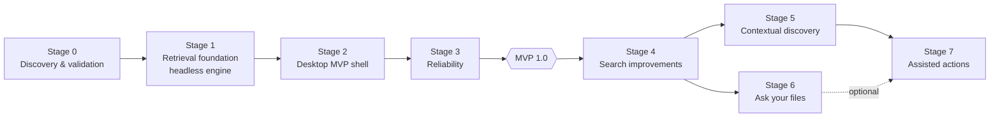
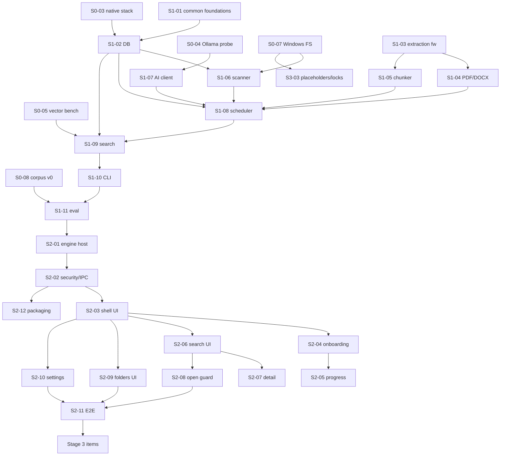

# 08 — Development Roadmap

> Status: **Draft for approval** · Related: [11 Backlog](11-implementation-backlog.md) · [09 Workflow](09-team-and-workflow.md) · [10 Risks](10-risks-and-open-decisions.md)

## 1. Shape of the roadmap

Order follows the brief with two deliberate adjustments:

1. **Packaging starts in Stage 2, not at the end.** Native modules (better-sqlite3, sqlite-vec, @parcel/watcher) are the most likely packaging failure; building an installer early surfaces it while the codebase is small.
2. **Stages 5 and 6 both depend only on Stage 4** and can be swapped. If the hackathon judges weight visible LLM use, Stage 6 can go first (decision D-13). Stage 7 depends on Stage 5's version/duplicate detection.

**Smallest complete MVP = end of Stage 3** (scope in [01 §7](01-product-specification.md)). A *demo cut* for a hackathon deadline is defined in §11.

## 2. Effort estimation assumptions

- Unit = **focused implementation day** by the single implementer (one Claude Code session ≈ 0.5–1 day of work), excluding human review wait time.
- Includes tests and docs for each item; excludes waiting for decisions, corpus creation by the team, and usability sessions.
- Ranges reflect uncertainty; Stage 0 results re-estimate Stages 1–3.
- Calendar time ≈ 1.5–2× effort when review cycles are included.

| Stage | Effort (days) | Cumulative |
|---|---|---|
| 0 | 4–6 | 4–6 |
| 1 | 10–14 | 14–20 |
| 2 | 11–15 | 25–35 |
| 3 | 8–11 | **33–46 (MVP)** |
| 4 | 9–13 | 42–59 |
| 5 | 5–8 | 47–67 |
| 6 | 7–10 | 54–77 |
| 7 | 6–9 | 60–86 |

## 3. Stage 0 — Discovery and technical validation

| | |
|---|---|
| **Goals** | Turn the riskiest assumptions into measurements before building on them. |
| **User value** | None directly; prevents rework. |
| **Features** | None user-facing. Spikes, a pinned toolchain skeleton, the first eval corpus. |
| **Dependencies** | Plan approved; D-02 (dev machine) and D-03 (permission to pull `nomic-embed-text`, and optionally candidate models) resolved. |
| **Tasks** | S0-01 … S0-10 in [11](11-implementation-backlog.md): repo + ADRs; toolchain skeleton with pinned versions/licences; native module spike (better-sqlite3 + sqlite-vec + FTS5 in Node, Electron main, utilityProcess, packaged); Ollama probe; vector search benchmark; Windows FS spike; extraction spike; corpus v0 + pilot queries; embedding candidate comparison; Stage 0 report. |
| **Artifacts** | `docs/adr/*.md`; `docs/validation/stage0-report.md` with measured numbers; `tests/fixtures/corpus` v0; `tests/eval/queries.jsonl` (≥ 30 pilot queries); skeleton app that opens an empty window. |
| **Acceptance** | (1) Native module stack loads in all four contexts or an alternative is chosen and documented. (2) Vector search p95 at 50k and 200k chunks measured; ADR-006 confirmed or switched. (3) Embedding throughput (chunks/s) and query-embedding latency (warm/cold) measured for the default model. (4) Placeholder-detection mechanism chosen. (5) NFR targets in [01 §5](01-product-specification.md) revised with real numbers. |
| **Tests** | Spike scripts are throwaway but their results are recorded; the skeleton has a passing `typecheck`/`lint`/`test` (one trivial test). |
| **Risks** | better-sqlite3 v13 N-API binary not loading in Electron (fallback: rebuild via `@electron/rebuild`, or `node:sqlite`); sqlite-vec DLL loading from asar; slow CPU embedding. |
| **Deferrable** | Embedding candidate comparison beyond the default model (can move to S1-11). |
| **Effort** | 4–6 days. |

## 4. Stage 1 — Retrieval foundation (headless engine)

| | |
|---|---|
| **Goals** | A complete, tested indexing + search engine runnable without Electron, with measured retrieval quality. |
| **User value** | Indirect: proves the core promise ("find by meaning") with numbers. |
| **Features** | DB + migrations; scanner + reconcile; hashing + content addressing; extraction (TXT/MD/code/PDF/DOCX) in worker pool; chunker; Ollama client + fake/recorded providers; scheduler with lanes; keyword + file-name + vector search; RRF; duplicate collapse; snippets/highlights/match reasons; headless CLI; eval harness + baseline. |
| **Dependencies** | Stage 0 complete. |
| **Tasks** | S1-01 … S1-12. |
| **Artifacts** | `src/engine/**`, `src/shared/**`; `scripts/eval.ts`, `scripts/bench.ts`; `eval-results/baseline-*.md`; recorded embeddings for the fixture corpus. |
| **Acceptance** | (1) `npm test` green with ≥ 80% line coverage on `engine/search`, `engine/chunk`, `engine/pipeline`. (2) CLI indexes the fixture corpus and answers queries. (3) Eval baseline recorded for keyword/semantic/hybrid; hybrid meets Stage 1 gates in [07 §5.4](07-testing-and-acceptance.md) **or** the gap is reported with analysis and a plan approved by the team. (4) Change-detection matrix ([07 §4.2](07-testing-and-acceptance.md)) passes for reconcile. (5) Network guard in `fail` mode across all tests. (6) No document text in logs (canary test). |
| **Tests** | Unit, integration, extraction fixtures, crash loop (engine as child process), eval. |
| **Risks** | Retrieval quality below target on paraphrase/conceptual queries; PDF text reconstruction quality; embedding throughput. |
| **Deferrable** | Porter/trigram variants, aggregation experiments beyond baseline. |
| **Effort** | 10–14 days. |

## 5. Stage 2 — Desktop MVP

| | |
|---|---|
| **Goals** | The engine inside a secure Electron app with the core screens. |
| **User value** | First usable product: onboard, add folders, watch indexing, search, see evidence, open files. |
| **Features** | utilityProcess engine host + supervisor; security baseline; preload API + IPC contract; app shell; onboarding (welcome, AI readiness incl. consented model download, folders); indexing progress; search + results + evidence; document detail; open/reveal/copy with guard; folders management (add/remove/exclusions/pause/rebuild/failures/retry); settings (AI status, data location/size, delete all data, logs); E2E harness; installer. |
| **Dependencies** | Stage 1. D-05 (visual direction sign-off) before S2-03 finishes. |
| **Tasks** | S2-01 … S2-12. |
| **Artifacts** | `src/main/**`, `src/preload/**`, `src/renderer/**`; `electron-builder.yml`; `tests/e2e/**`; first installer in `dist/`. |
| **Acceptance** | (1) E2E flows 1, 2, 4, 6 ([07 §9](07-testing-and-acceptance.md)) pass. (2) Security checks SEC-01…04, SEC-06 pass. (3) Packaged installer installs per-user, runs `--smoke-test` successfully, and completes onboarding on a clean user profile. (4) Search latency targets met in the app (not just CLI) on the fixture corpus. (5) axe: zero serious/critical violations on all MVP screens. |
| **Tests** | E2E, contract fuzz, security E2E, packaged smoke. |
| **Risks** | IPC/MessagePort plumbing complexity; packaging native modules; renderer performance with large result/document views. |
| **Deferrable** | Example queries, polish animations, dark-mode refinements. |
| **Effort** | 11–15 days. |

## 6. Stage 3 — Reliability (→ MVP 1.0)

| | |
|---|---|
| **Goals** | Trustworthy daily use: index stays correct as files change, failures recover, offline verified. |
| **User value** | "It just keeps working" — the difference between a demo and a product. |
| **Features** | Live watcher; periodic/power-event reconcile; unavailable folders; placeholder/locked/long-path handling; crash recovery hardening; DB integrity + rebuild + migration backup; AI circuit breaker & recovery; restart UX; network audit + offline validation; performance pass; accessibility pass; user docs; release candidate. |
| **Dependencies** | Stage 2. |
| **Tasks** | S3-01 … S3-10. |
| **Artifacts** | `docs/validation/offline-*.md`, `network-audit-*.md`, `perf-*.md`, `a11y-*.md`; `docs/user/`; MVP installer. |
| **Acceptance** | (1) Full change-detection matrix passes for watcher **and** reconcile. (2) Crash loop: 20/20 consistent. (3) Offline procedure passes all 13 steps. (4) Network audit: zero non-loopback attempts (guard) and zero firewall drops. (5) NFR-03/04/08/09 met on the dev machine at the revised targets. (6) NVDA + Narrator checklist passed. (7) Clean-machine install → first search ≤ 15 min (models pre-pulled). (8) Human sign-off of MVP. |
| **Risks** | Watcher edge cases on Windows (bursts, network drives, sleep); OneDrive behaviour. |
| **Deferrable** | Network-drive support (documented as best effort), battery throttling. |
| **Effort** | 8–11 days. |

## 7. Stage 4 — Search improvements

| | |
|---|---|
| **Goals** | Better ranking for real-world memory queries; filters; versions; optional OCR. |
| **User value** | UC-03, UC-05, UC-06; fewer near-identical results; screenshots become searchable. |
| **Features** | Filters UI; temporal intent; expanded eval set + ranking round 2 + τ targets; version grouping; richer evidence & match navigation; OCR (opt-in, bundled data); embedding model change flow; global shortcut; opt-in history; throttle modes; storage reduction if needed. |
| **Dependencies** | MVP. D-06 (OCR in scope?) before S4-06. |
| **Tasks** | S4-01 … S4-09. |
| **Acceptance** | Stage 4 gates in [07 §5.4](07-testing-and-acceptance.md) on the 160-query set; temporal queries ≥ 0.8 Recall@5 for the intended version; OCR off → zero OCR network/CPU use; OCR on → image fixture queries found; model change completes with search available throughout. |
| **Risks** | OCR speed on CPU; version grouping false merges. |
| **Effort** | 9–13 days. |

## 8. Stage 5 — Contextual discovery

| | |
|---|---|
| **Goals** | Surface connected and forgotten material without a query. |
| **User value** | UC-07; version comparison. |
| **Features** | Content vectors + Related panel; version compare (text diff); Discover screen (possibly forgotten, project groups). |
| **Dependencies** | Stage 4 (version groups, content-level structures). |
| **Tasks** | S5-01 … S5-03. |
| **Acceptance** | On fixture corpus, ≥ 70% of hand-labelled "related" pairs appear in top-5 related; compare view correctly highlights changed payment terms between fixture versions; no LLM required. |
| **Effort** | 5–8 days. |

## 9. Stage 6 — Ask your files

| | |
|---|---|
| **Goals** | Grounded, cited multi-document answers that abstain when evidence is weak. |
| **User value** | UC-08, UC-09. |
| **Features** | Chat provider + bake-off; ask pipeline (retrieval, diversification, prompt, structured output, citation/quote validation, conflicts, abstention); Ask UI; QA eval + injection suite; memory checks. |
| **Dependencies** | Stage 4 (confidence calibration, version groups). D-04 (chat model + licence). |
| **Tasks** | S6-01 … S6-04. |
| **Acceptance** | Targets in [07 §12](07-testing-and-acceptance.md); injection suite 100%; Ask disabled gracefully when memory insufficient; search unaffected while generating. |
| **Risks** | Small-model answer quality on CPU; latency (time to first token); JSON schema adherence. |
| **Effort** | 7–10 days. |

## 10. Stage 7 — Assisted actions

| | |
|---|---|
| **Goals** | Carefully scoped, user-approved file operations. |
| **User value** | UC-10: tidy drafts and duplicates safely. |
| **Features** | Action model + executor in main (move/rename/Recycle Bin), action log + undo; deterministic suggestion generators; review UI. |
| **Dependencies** | Stage 5 (versions, duplicates, groups); security review of executor. |
| **Acceptance** | No file operation without a per-item approval in the same session; every operation undoable (moves/renames) or recoverable (Recycle Bin); stale-plan detection (file changed since suggestion) blocks execution; full test suite on temp folders. |
| **Effort** | 6–9 days. |

## 11. Demo cut (if a hackathon deadline applies — D-13)

If a deadline arrives before MVP 1.0, the demo cut is: S0-01…S0-05, S0-08; S1-01…S1-11; S2-01…S2-08 (+ S2-12 unsigned installer); a minimal Ask preview (S6-01 + S6-02 with the fixed Apache-2.0 model, no bake-off) behind a "Preview" label. Explicitly *not* claimed in a demo cut: offline validation (unless S3-07 is run), reliability features, accessibility sign-off.

## 12. Cross-stage dependency map

