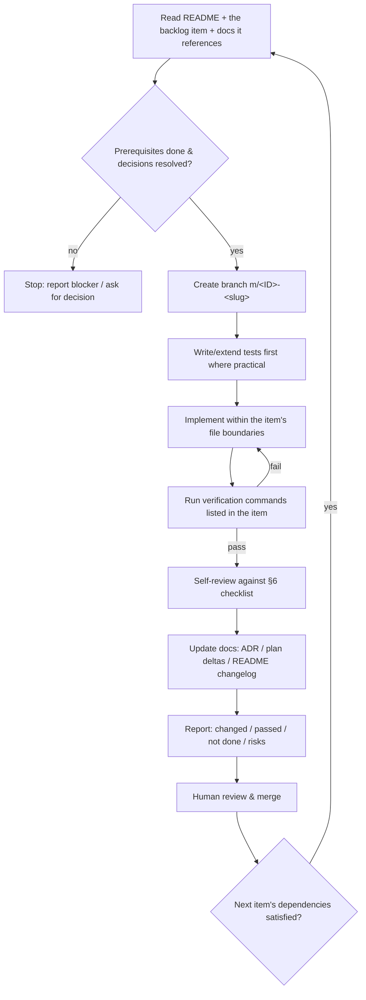

# 09 — Team and Workflow

> Status: **Draft for approval** · Related: [08 Roadmap](08-development-roadmap.md) · [11 Backlog](11-implementation-backlog.md)

## 1. Roles

| Role | Who | Responsibilities |
|---|---|---|
| Product owner / approver | Human team | Approves this plan, resolves decisions in [10](10-risks-and-open-decisions.md), accepts each stage, supplies the evaluation corpus and usability participants. |
| Implementer (technical lead) | Claude Code sessions | Implements one backlog milestone at a time, writes tests, runs verification, updates docs, reports honestly. |
| Reviewer | Human team (one named reviewer per milestone) | Reviews each milestone PR against the checklist in §6; runs the manual checks the milestone lists. |

Because one implementer works alone, the workflow is designed to keep each change **small, verifiable, and reversible**.

## 2. The milestone loop

Each implementation session follows exactly this loop. One session = one backlog item (or a small, explicitly grouped set marked as such in [11](11-implementation-backlog.md)).



Rules:

1. **Never start an item whose dependencies are not merged.** Dependencies are listed per item in [11](11-implementation-backlog.md).
2. **Stay inside the item's scope.** If a necessary change falls outside the listed files/modules, note it in the report; if it is non-trivial, stop and propose a new backlog item.
3. **No silent plan changes.** If implementation shows a plan decision is wrong, write a short ADR (§5) and flag it in the report before proceeding.
4. **Evidence or it didn't happen.** Reports quote actual command output (pass/fail counts, eval metrics). "Should work" is never a completion claim.
5. **No generated mega-commits.** A milestone diff larger than ~800 changed lines (excluding fixtures, lockfile, migrations snapshots) should be split.

## 3. Repository conventions

| Topic | Convention |
|---|---|
| VCS | Git. The repository is **not yet initialised**; `git init` + initial commit of `docs/` is backlog item S0-01. |
| Branches | `main` always releasable-to-dev (tests green). Work on `m/<backlog-id>-<slug>` (e.g. `m/S1-04-chunker`). Squash-merge. |
| Commits | Conventional Commits (`feat(engine): …`, `fix(search): …`, `test: …`, `docs: …`). |
| Package manager | **npm** (lockfile committed, `npm ci` in CI). Rationale: Electron packaging tools work most predictably with npm's flat `node_modules`; pnpm requires `node-linker=hoisted` workarounds. |
| Node version | Pinned in `.nvmrc` and `package.json#engines` to the active LTS used by the toolchain (dev machine currently has Node 24.21.0). Electron bundles its own Node for runtime; see [03 §3](03-system-architecture.md). |
| Language | TypeScript `strict: true`, ESM. |
| Lint/format | ESLint (typescript-eslint) + Prettier. |
| Tests | Vitest (unit/integration), Playwright Electron (E2E). |
| Docs | Plan docs in `docs/app-plan/`; ADRs in `docs/adr/NNNN-title.md`; user-facing help in `docs/user/` (Stage 3). |

### 3.1 Standard npm scripts (referenced by all backlog items)

| Script | Purpose |
|---|---|
| `npm run typecheck` | `tsc --noEmit` across all targets |
| `npm run lint` | ESLint + Prettier check |
| `npm test` | Unit + integration tests (no live model, no network) |
| `npm run test:live` | Tests that need a running Ollama + pulled models (opt-in, tagged `@live`) |
| `npm run eval` | Retrieval evaluation harness on the fixture corpus; writes a JSON + Markdown report to `eval-results/` |
| `npm run bench` | Indexing / latency / memory benchmarks; writes report |
| `npm run e2e` | Playwright Electron tests against a dev build |
| `npm run audit:network` | Runs the app headless through the scripted workflow with the network guard in *fail* mode ([06 §8](06-security-and-privacy.md)) |
| `npm run dev` | Electron dev with HMR |
| `npm run package` | Build Windows installer to `dist/` |

## 4. Definitions of Ready and Done

**Ready** (before starting an item):
- Item exists in [11](11-implementation-backlog.md) with dependencies, files, tests, acceptance criteria.
- All dependencies merged; blocking decisions in [10](10-risks-and-open-decisions.md) resolved.
- Any required fixture/corpus data available.

**Done** (before reporting complete):
- Acceptance criteria met, each with evidence.
- `typecheck`, `lint`, `test` pass; plus item-specific commands (`eval`, `e2e`, `bench`, `audit:network`) where listed.
- New code paths covered by tests at the level the item specifies.
- No new non-loopback network calls; no new dependency without §7 checks.
- Docs updated (ADR/plan delta/user docs as applicable).
- Report delivered in the §8 format.

## 5. Architecture Decision Records

Short ADRs in `docs/adr/` (template: Context · Decision · Alternatives · Consequences · Status). Initial ADRs are the decisions already recorded in [03 §9](03-system-architecture.md); Stage 0 converts them into files once validated. Any change to a decision in this plan requires a new ADR that supersedes the old one and a one-line entry in the README changelog.

## 6. Review checklist (implementer self-review and human review)

**Correctness & scope**
- [ ] Does exactly what the backlog item says; no unrelated changes.
- [ ] Errors handled per [03 §7](03-system-architecture.md) (typed errors, user-facing messages, no swallowed exceptions).

**Security & privacy** ([06](06-security-and-privacy.md))
- [ ] Any new IPC channel is declared in the shared contract with a zod schema; main validates sender + payload.
- [ ] Renderer receives IDs, never constructs filesystem paths for privileged operations.
- [ ] No document text, query text, or (by default) file paths in logs.
- [ ] Document content rendered as text, never HTML; never interpolated into shell commands.
- [ ] No new outbound network destinations.
- [ ] No write/delete of user files (until Stage 7, where the action executor is the only allowed path).

**Data**
- [ ] Schema change has a forward migration + test; migration is idempotent and transactional.
- [ ] Deletions cascade correctly (no orphaned chunks/vectors/FTS rows) — covered by a test.

**Quality**
- [ ] Tests are deterministic (fake embeddings, fixed clock, temp dirs).
- [ ] Retrieval-affecting changes include before/after `npm run eval` numbers.
- [ ] Performance-affecting changes include `npm run bench` numbers.

**UX**
- [ ] Loading, empty, error, success states implemented as in [02](02-ux-and-user-flows.md).
- [ ] Keyboard and screen-reader labels checked.

## 7. Dependency policy

- Only dependencies in the approved list ([03 §3.3](03-system-architecture.md)) may be added without discussion. Anything else: justify in the report (purpose, alternatives, size, maintenance, licence).
- Licences: MIT, ISC, BSD, Apache-2.0, MPL-2.0 (file-level) acceptable. GPL/AGPL/LGPL or "research-only"/non-commercial licences require explicit approval (this includes **model** licences — see D-04).
- Native modules must have Windows x64 prebuilds or a documented rebuild step verified in CI/packaging.
- `npm audit` reviewed on each dependency change; high/critical issues must be addressed or explicitly accepted.
- No dependency may perform network calls at runtime (e.g. CDN fetches for language data, telemetry). Verified by the network guard ([06 §8](06-security-and-privacy.md)).

## 8. Report format (end of every session)

```
## <Backlog ID> — <title>
Status: Done | Partially done | Blocked
Changed: <files/modules, one line each>
Verification:
  typecheck: pass | lint: pass | test: 142 passed, 0 failed
  eval: hybrid R@10 0.87 (prev 0.84), MRR 0.66 (prev 0.61)   ← if applicable
Acceptance criteria: AC1 ✓ (evidence) · AC2 ✓ · AC3 ✗ (why)
Not done / deferred: …
Risks / regressions to watch: …
Decisions needed: …
Docs updated: …
```

## 9. Integration cadence

- Each merged milestone leaves `main` green and the app launchable (`npm run dev`) from Stage 2 onward.
- An installer is built (`npm run package`) at least at the end of every stage from Stage 2, and smoke-tested on a clean Windows user profile (or VM) — packaging problems with native modules surface early.
- Stage exit = all stage items done + stage acceptance criteria ([08](08-development-roadmap.md)) + human sign-off.

## 10. Continuous integration (recommended)

When a remote repository exists (decision D-10), add a GitHub Actions workflow on `windows-latest`: `npm ci` → `typecheck` → `lint` → `test` → `eval` (fake + fixture-recorded embeddings, no Ollama) → `package` (on tags). Live-model tests and E2E run locally on the dev machine before stage sign-off, because CI runners won't have Ollama models available.
