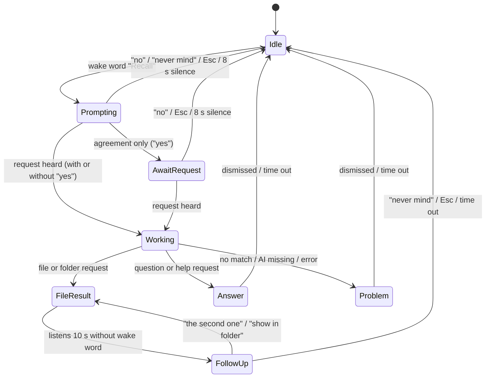
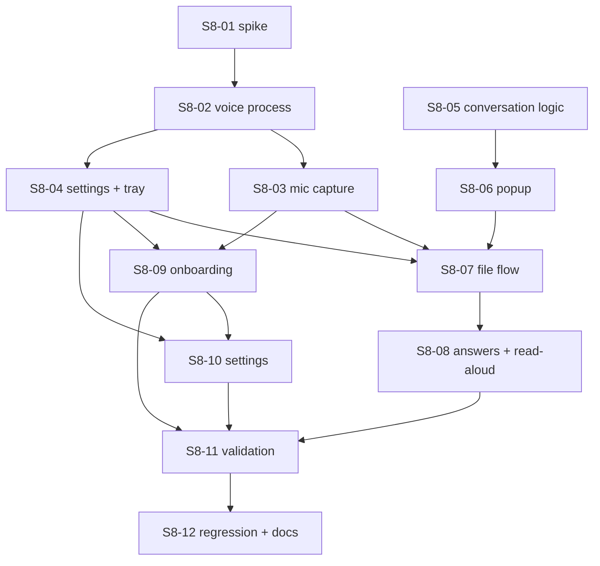

# 12 — Voice Assistant ("Recall" wake word)

> Status: **Approved 2026-10-09** · S8-01 done ([report](../validation/s8-01-voice-spike.md)) · Stage 8 · Plan date: 2026-10-09 · Backlog: [§9](#9-stage-8-backlog)
>
> Say **"Recall"** from anywhere on the PC. A small popup appears near the mouse pointer. Ask a question about your files and the answer appears there and is read aloud. Ask for a file or folder and its path is copied to the clipboard. Everything runs on this computer.

## 1. Scope

**In:** wake word, confirmation prompt, spoken requests, answers from the user's files, copying file and folder paths, read-aloud, tray mode, start with Windows, onboarding step, Settings section.

**Out:** conversation history (every request stands alone, like Ask), general-knowledge answers, voice control of the main window, languages other than English, customising the wake word, cloud speech services of any kind.

### 1.1 Settled with the developer (2026-10-09)

| Topic | Decision |
|---|---|
| Wake word | "Recall" alone. The confirmation popup catches accidental triggers. |
| Confirmation | Popup near the pointer: "Do you need me?" / "Should I help you with something?". The user agrees ("yes", "yeah", …), optionally with the request in the same sentence. |
| Answers | **From indexed files only**, through the existing Ask pipeline. Recall says so when the files don't answer the question. |
| Files and folders | Copy the **best match's path** right away. List 2–4 other matches, selectable by click or by voice ("the second one"). Tell the user to paste the path into File Explorer. Offer **Show in folder**. |
| Replies | Popup text **and** read aloud with offline Windows voices. Read-aloud can be muted. |
| Listening | Keeps listening when the window is closed (system **tray**). "Start with Windows" is an option. |
| Defaults | Voice off until turned on. One-shot "Recall, find my resume" allowed. Dismiss with "no", "never mind", Esc, or after about 8 s of silence. |
| Onboarding | New optional **Voice** step between Folders and Ready. Same controls in Settings. |
| Platform | Fully on-device. Network audit must still pass (NFR-02). Typing still does everything voice does (NFR-11). |

Open items that still need approval are in [§8](#8-decisions-risks-assumptions).

## 2. User flow



Example exchanges:

| User says | Recall does |
|---|---|
| "Recall" … "yeah, where's my lease agreement?" | Copies the lease's path. Popup: file name, folder, "Path copied", 3 other matches. Says "Copied the path to Lease 2025.pdf." |
| "Recall, find my tax folder" | Skips the prompt. Copies the folder path. |
| "Recall" … "yes" … "when is the Acme payment due?" | Popup: "What do you need?", then a streamed answer with sources, read aloud when complete. |
| "Recall" … "no" | Popup closes. Nothing else happens. |
| (after a file result) "the second one" | Copies the 2nd listed path instead and says so. |

## 3. Functional requirements (FR-VOICE)

Priority: M = must for this stage, S = should.

| ID | Requirement | P |
|---|---|---|
| FR-VOICE-01 | Voice is **off by default**. A **Voice On / Off** switch in onboarding and in Settings turns it on or off; the microphone is opened only while it is On. | M |
| FR-VOICE-02 | While voice is on, Recall listens for "Recall", including while the main window is hidden in the tray. | M |
| FR-VOICE-03 | On the wake word, a popup appears near the mouse pointer (on the pointer's screen, kept inside its work area) without taking focus from the current app. It shows one of the prompt variants. | M |
| FR-VOICE-04 | The next utterance (within 8 s) is classified: **agreement only** → "What do you need?" and wait again; **request** (with or without agreement) → handle it; **refusal** → close; **silence** → close. | M |
| FR-VOICE-05 | The popup shows what Recall heard ("You said: …") so a misheard request is visible. | M |
| FR-VOICE-06 | A request is routed to **file/folder** or **question** by deterministic rules ([§6.3](#63-intent-rules)). | M |
| FR-VOICE-07 | File request: copy the best match's full path, show name + folder + "Path copied — in File Explorer press Ctrl+L, then Ctrl+V and Enter", list up to 4 other matches, and offer **Show in folder** and **Open in Recall**. | M |
| FR-VOICE-08 | Folder request: copy the matching folder's path (see D-20). Same popup as FR-VOICE-07. | M |
| FR-VOICE-09 | For 10 s after a file result, Recall listens without the wake word for: an ordinal ("the second one", "number three"), "show in folder", "never mind". | M |
| FR-VOICE-10 | Question: answer via the existing Ask pipeline (files only, cited, abstains when evidence is weak). The answer streams into the popup and sources open through the open-file guard. | M |
| FR-VOICE-11 | Replies are read aloud when "Read replies aloud" is on. Citation markers are not spoken. Esc, "stop" or clicking the popup stops speech. | M |
| FR-VOICE-12 | Tray icon with states **Off / Listening / Muted / Working** (text tooltip, not colour only) and menu: Open Recall, Mute voice / Unmute voice, Quit Recall. | M |
| FR-VOICE-13 | While voice is on, closing the window hides Recall to the tray (see D-18). Quit is in the tray menu. | M |
| FR-VOICE-14 | "Start with Windows" (off by default) starts Recall hidden in the tray. | M |
| FR-VOICE-15 | Degraded modes are explained in the popup or tray: no local AI → files still found by keyword, questions get "Questions need the answer model. Set it up in Recall → Settings."; no microphone or Windows mic access off → tray warning + Settings message with **Open Windows microphone settings**; mic unplugged → pause, resume when it returns. | M |
| FR-VOICE-16 | "Open in Recall" opens the main window on Search (file request) or Ask (question) with the transcript filled in, so it can be corrected by typing. | S |
| FR-VOICE-17 | "Delete all Recall data" also turns voice off and removes the start-with-Windows entry. | M |
| FR-VOICE-18 | Wake sensitivity setting (Lower / Normal / Higher) for fewer false triggers or fewer misses. | S |

## 4. Non-functional targets

Targets, not verified. S8-01 checks that they are realistic and S8-11 measures them on the dev machine (D-02).

| ID | Area | Target |
|---|---|---|
| NFR-V-01 | Wake detection | ≥ 90% of "Recall" utterances detected on the recorded test set (≥ 2 speakers, normal room). |
| NFR-V-02 | False wakes | ≤ 1 popup per hour on the non-wake speech set (conversation, podcasts, sentences using "recall" in other ways count separately and are reported). |
| NFR-V-03 | Wake → popup | ≤ 800 ms after the word ends (revised from 500 ms by S8-01: the models need ~0.5 s of trailing audio; measured p50 630 ms, max 730 ms on synthetic speech). |
| NFR-V-04 | End of speech → file result | ≤ 2 s (same as NFR-05). |
| NFR-V-05 | Idle cost (approved 2026-10-09: load speech-to-text on the wake word) | Listening idle ≤ 3% average CPU (S8-01: 2.9% of one core); voice process ≤ 150 MB RSS idle and ≤ 350 MB during a request (revised by S8-01: all models loaded is ~320 MB, so speech-to-text loads on the wake word and unloads when idle). |
| NFR-V-06 | Network | Unchanged NFR-02: zero non-loopback connections from any Recall process, voice on. |
| NFR-V-07 | Audio retention | Audio is never written to disk or logs; transcripts are never logged (FR-PRIV-03). |

## 5. Screens

### 5.1 Voice popup

For most voice use, the popup is all the user sees, so it is designed as carefully as the main window: short friendly copy, one clear outcome per state, and the same look as Recall.

**Visual design**

| Aspect | Spec |
|---|---|
| Shape | Card 360–420 px wide; height fits the content up to 480 px, then the answer scrolls. 12 px radius, soft shadow, 1 px border. Uses the app's colour tokens (navy and light blue brand; light or dark follows the system theme). |
| Type | System UI font (Segoe UI Variable on Windows 11, Segoe UI on 10). Title 15 px semibold, body 14 px, secondary text 12.5 px, never smaller than 12 px. Follows the Windows text-size setting. |
| Header | Recall logo mark plus a **live status pill**: "Listening" (gently pulsing light-blue dot and a 5-bar mic level), "Thinking", "Done", "Muted". Close button (×) with a 32 px hit area. |
| Placement | 16 px below and right of the pointer. Flips left or up near screen edges so it never covers the pointer or leaves the work area. Follows the pointer's monitor and DPI. |
| Motion | 120 ms fade plus a 4 px rise on show, 90 ms fade on close. State changes cross-fade instead of jumping. With "reduce motion" on: no movement and no pulse. |
| Files | File-type icon, **file name in semibold**, folder path shortened in the middle ("C:\Users\…\Housing") with the full path in a tooltip. A green "✓ Copied" chip next to the name that animates in once. |
| Answers | 14 px text, line-height 1.5, up to 8 lines before "Show more". Citations are small numbered chips; sources are listed underneath, each clickable. |
| Hints | Keyboard and voice hints in muted 12.5 px text at the bottom: "Say "the second one" · Esc to close". |
| Contrast | All text ≥ 4.5:1 in both themes. Windows high-contrast mode uses system colours. |

**Wireframes**

```
  Prompt (wake word heard)
  ╭──────────────────────────────────────────╮
  │ ◆ Recall   ● Listening ▂▄▆▄▂          ×  │
  │                                          │
  │ Hi! What can I find for you?             │
  │ Try "find my lease" or ask a question.   │
  ╰──────────────────────────────────────────╯

  File result
  ╭──────────────────────────────────────────╮
  │ ◆ Recall   ✓ Done                     ×  │
  │ "find my lease agreement"                │
  │                                          │
  │ 📄 Lease 2025.pdf            ✓ Copied    │
  │    C:\Users\…\Documents\Housing          │
  │                                          │
  │ Paste it in File Explorer: Ctrl+L,       │
  │ then Ctrl+V and Enter.                   │
  │ [ Show in folder ]   [ Open in Recall ]  │
  │ ──────────────────────────────────────── │
  │ Not this one?                            │
  │  2  📄 Lease 2024.pdf      …\Housing\Old │
  │  3  📝 Lease notes.md      …\Notes       │
  │ Say "the second one" · Esc to close      │
  ╰──────────────────────────────────────────╯

  Answer
  ╭──────────────────────────────────────────╮
  │ ◆ Recall   ✓ Done                 🔊  ×  │
  │ "when is the Acme payment due?"          │
  │                                          │
  │ The Acme payment is due on 15 March,     │
  │ with 50% paid upfront. [1] [2]           │
  │                                          │
  │ Sources                                  │
  │  1  📄 Acme contract.pdf · page 3        │
  │  2  📝 Payment notes.md                  │
  ╰──────────────────────────────────────────╯
```

**Copy deck.** Every message the popup can show: plain, short, friendly, no jargon.

| State | Title | Detail |
|---|---|---|
| Prompt | One of: "Hi! What can I find for you?", "I'm listening. What do you need?", "Yes? How can I help?" | "Try "find my lease" or ask a question." |
| After "yes" only | "Sure, go ahead." | "Tell me the file or the question." |
| Working (file) | "Looking for "lease agreement"…" | — |
| Working (question) | "Reading your files…" | "This can take a few seconds." |
| File found | File name + "✓ Copied" | "Paste it in File Explorer: Ctrl+L, then Ctrl+V and Enter." |
| Folder found | Folder name + "✓ Copied" | Same as above |
| Picked another | "Copied the second match instead." | — |
| No match | "I couldn't find "lease agreement"." | "Try other words, or open Recall to search." + [ Open in Recall ] |
| Files don't answer | "I couldn't find that in your files." | "Your files don't seem to mention it." + [ Open in Recall ] |
| Didn't catch it | "Sorry, I didn't catch that." | "Say "Recall" to try again." |
| Questions need the model | "I can find files, but answering questions needs the answer model." | "Set it up in Recall → Settings → Local AI." + [ Open Settings ] |
| Mic problem | "I can't hear the microphone." | "Check that it's plugged in and allowed in Windows settings." + [ Open microphone settings ] |
| Busy indexing | (title unchanged) | Footer: "Recall is still reading your files, so results may be incomplete." |
| Spoken versions | Short: "Copied the path to Lease 2025." · "I couldn't find that." · the answer text without citation numbers | — |

Rules:
- Titles are 60 characters at most.
- Never blame the user, and always give one next step.
- Show the transcript in quotes, so a mishearing is obvious.
- No "error", "failed" or error codes in user text. Codes go to the log only.

| | |
|---|---|
| Goal | Answer or hand over a path without leaving the current app. |
| Primary | Copy happens automatically; **Show in folder**. |
| Secondary | Pick another match; Open in Recall; replay or stop speech (🔊); close. |
| Loading | Working titles from the copy deck, with a slim indeterminate bar. Answers stream in. |
| Dismiss | × button, Esc, "never mind". The prompt closes after 8 s of silence. Results close after 60 s unless the pointer is over the popup (D-24). |
| A11y | All buttons are keyboard reachable once the popup has focus. Text is not colour-only. Respects reduced motion and high contrast. When screen readers can't see the unfocused window, the spoken reply announces it (R-22). |

### 5.2 Onboarding — Voice step (new step 4 of 5)

```
┌──────────────────────────────────────────────────────────────┐
│  Talk to Recall                                  Step 4 of 5 │
│  Say "Recall" from any app, then say what you need. Answers  │
│  and copied file paths appear next to your mouse pointer.    │
│                                                              │
│  Voice        ( ● Off )  (   On   )                          │
│                                                              │
│  Listening happens on this computer. Audio is never saved    │
│  or sent anywhere.                                           │
│ ┄┄┄┄┄┄┄┄┄┄┄┄┄┄┄┄ shown when On ┄┄┄┄┄┄┄┄┄┄┄┄┄┄┄┄┄┄┄┄┄┄┄┄┄┄┄┄ │
│  Try it: say "Recall"     ▁▂▅▇▅▂▁  mic level     ✓ Heard you │
│  [✓] Read replies aloud                                      │
│  [ ] Start Recall when Windows starts                        │
│  Closing the window keeps Recall in the tray so it can       │
│  listen. Quit from the tray icon.                            │
│                                                              │
│  [ Back ]                                      [ Continue ]  │
└──────────────────────────────────────────────────────────────┘
```

| | |
|---|---|
| Goal | Choose voice On or Off. If On, prove the mic works. |
| Primary | A two-option **Voice On / Off** switch (radio group, Off selected by default). Continue works with either choice. |
| On | Asks for the microphone, starts listening, and reveals the practice row and the two toggles. |
| Off | The microphone is not opened, and the practice row and toggles stay hidden. The hint says "You can turn voice on later in Settings → Voice." |
| Key info | Privacy line; mic level; wake confirmation; tray behaviour. If the answer model is missing: "Finding files by voice works now. Answering questions needs the answer model." |
| Error | Mic blocked → "Windows is blocking the microphone for desktop apps." + **Open Windows microphone settings**, and the switch returns to Off. No mic → "No microphone found.", and the switch returns to Off. Voice files missing or damaged → "Voice files are damaged. Reinstall Recall." |
| Success | ✓ Heard you (live region); Continue focused. Not hearing the wake word never blocks Continue. |
| A11y | The switch is a labelled radio group operable with arrow keys; the level meter has a text equivalent; toggles are real checkboxes. |

Other onboarding changes:
- The stepper becomes Welcome → Local AI → Folders → **Voice** → Ready.
- Ready shows a "Voice" tip ("Say *Recall, find my resume*") when voice is on, or "Voice is off. Turn it on in Settings → Voice." when it is off.
- The "Runs on this computer" promise text mentions voice.

### 5.3 Settings → Voice

The same **Voice On / Off** switch and toggles as 5.2, plus: Mute until I unmute, Wake sensitivity (FR-VOICE-18), microphone in use (system default), status line (Listening / Muted / Off / Problem + reason).

### 5.4 Tray

Icon + tooltip per state. Left click opens Recall; right click opens the menu (FR-VOICE-12). Windows' own taskbar microphone indicator also shows while listening.

## 6. Architecture

### 6.1 Processes

```mermaid
flowchart LR
    subgraph Renderer["Main window renderer (sandboxed)"]
        Cap[Mic capture<br/>AudioWorklet 16 kHz mono]
    end
    subgraph Voice["Voice utilityProcess (new)"]
        KWS[Keyword spotter "recall"] --> VAD[End-of-speech VAD] --> ASR[Offline speech-to-text]
    end
    subgraph Main["Main process"]
        Ctl[Voice controller<br/>session state machine + intent rules]
        Tray[Tray]
        Pop[Popup window]
    end
    Engine["Engine utilityProcess<br/>search / ask"]
    Cap -- MessagePort: audio frames only --> KWS
    Voice -- events: wake / utterance / level / error --> Ctl
    Ctl -- search / ask / findFolders --> Engine
    Ctl -- state --> Pop & Tray
    Pop -- select / reveal / openSource / dismiss / speaking --> Ctl
    Ctl -- clipboard.writeText / shell.showItemInFolder --> OS[(Windows)]
```

- **Voice runs in its own `utilityProcess`**, like the engine ([ADR-0003](../adr/0003-engine-utility-process.md)). A native speech crash then never takes down indexing, and speech-to-text never blocks search. Supervised and restarted like `EngineSupervisor`; network guard installed (`installNetworkGuard('voice')`).
- **Mic capture stays in the main window's renderer** (getUserMedia + AudioWorklet). The window is created even when Recall starts hidden. Main gives the renderer one end of a `MessageChannelMain` and the voice process the other, so audio never passes through IPC handlers. The voice process accepts only fixed-size PCM frames and drops anything else.
- **The voice controller lives in main**, because main owns the clipboard, windows, tray and the open-file guard. Its decision logic is pure modules (`session.ts`, `intent.ts`) with no Electron imports so they are unit-tested directly.
- **Read-aloud runs in the popup renderer** (`speechSynthesis`, local voices only, D-21). While it speaks, the controller tells the voice process to ignore audio so Recall doesn't hear itself.

### 6.2 New and changed modules

| Path | Change |
|---|---|
| `src/voice/index.ts`, `src/voice/pipeline.ts` | New: voice process entry; KWS → VAD → ASR pipeline; frame validation; model loading from `resources/voice/`. |
| `src/main/voice/supervisor.ts` | New: start/stop/restart voice process; MessageChannel setup. |
| `src/main/voice/session.ts`, `intent.ts`, `ordinal.ts` | New, pure: state machine ([§2](#2-user-flow)), confirmation/refusal parsing, intent rules, ordinal parsing. |
| `src/main/voice/controller.ts` | New: wires session to engine, clipboard, popup, tray. |
| `src/main/voice/popup.ts`, `src/preload/popup.ts`, `src/renderer/popup.html`, `src/renderer/src/popup/**` | New: popup window, its narrow preload API, React UI, read-aloud. |
| `src/main/tray.ts` | New: tray icon, menu, close-to-tray, login item. |
| `src/main/index.ts` | Changed: `hardenSession` allows **audio capture only, main window frame only**; `isTrustedSender` also accepts the popup frame for popup channels only; window close behaviour; `--hidden` start; delete-all turns voice off. |
| `src/shared/voice.ts`, `src/shared/wav.ts` | New (S8-02): main ↔ voice message types; WAV reader for fixtures and the smoke run. |
| `src/shared/constants.ts`, `src/shared/types.ts`, `src/preload/index.ts` | Changed: voice methods (`getVoiceSettings`, `setVoiceSettings`, `getVoiceStatus`) and `voice` status events. |
| `src/engine/service.ts`, `src/engine/search.ts` | Changed: voice settings in the `settings` table; `findFolders(query)` (D-20). |
| `src/renderer/src/views/Onboarding.tsx`, `SettingsView.tsx`, `src/renderer/src/voice/capture.ts` | Changed/new: Voice step, Settings → Voice, capture worklet. |
| `electron.vite.config.ts`, `electron-builder.yml` | Changed: voice + popup entries; models in `extraResources`; native addon in `asarUnpack`. |

### 6.3 Intent rules

Deterministic, no LLM in the routing decision (same principle as Stage 7). Applied to the transcript after stripping the wake word and agreement words.

| Rule (first match wins) | Route |
|---|---|
| Refusal only: no, nope, never mind, cancel, stop, not now | close |
| Agreement only: yes, yeah, yep, sure, okay, please, I do | ask "What do you need?" |
| Starts with or contains find / open / show / where is / where's / locate / get me / look for, **or** mentions file / folder / document / PDF / doc / spreadsheet | file (folder if it says folder/directory) |
| Question form (what, when, who, why, how, which, did, does, is, can, summarize, tell me, explain) | question |
| Anything else (a bare noun phrase like "the Acme contract") | file |

The rules table lives in code with its tests. Every misroute found in testing becomes a test case.

### 6.4 Speech stack (D-16)

Chosen by S8-01 ([ADR-0015](../adr/0015-on-device-voice.md)): **sherpa-onnx** (`sherpa-onnx-node` 1.13.8, Apache-2.0, prebuilt Windows binaries) for all three stages:
- Wake word: open-vocabulary keyword spotting with the **LibriSpeech streaming zipformer 20M** (int8, D-25). "recall" is given as sub-word tokens, so no training is needed.
- End of speech: **Silero VAD**. It also tells the pipeline when to reset the keyword stream; without the reset, detection fell from 100% to 58%.
- Speech-to-text: **Moonshine tiny English** (int8, MIT). On the 60 synthetic requests: 2.1% word error rate and 47 ms per request, against 9.3% / 190 ms for Whisper tiny.en.

Model files are bundled (D-17): about 186 MB on disk, ~132 MB compressed, so the installer grows from 138 MB to about 270 MB.

## 7. Security and privacy

| ID | Requirement | Verified by |
|---|---|---|
| SEC-13 | Only `media` with audio-only, only for the main window's own page, is granted. Video, screen capture and every other permission stay denied. The popup gets no permissions. | Unit test on the permission handler; E2E asserts a video request is denied |
| SEC-14 | The voice process and popup follow SEC-01/02/06: sandboxed popup renderer, CSP, validated IPC, sender frame checks, network guard in the voice process | E2E + `npm run audit:network` with voice on |
| SEC-15 | Audio lives only in memory (a short rolling buffer for the wake word). Nothing is written to disk. Transcripts and audio never appear in logs | Test: run a session, scan the data dir and logs for transcript canaries; code review |
| SEC-16 | Copied paths and "Show in folder" go through the existing id-based open-file guard. Spoken text never becomes a path | Test: a transcript containing a path is treated as a search query only |

Privacy copy that must stay true: "Listening happens on this computer. Audio is never saved or sent anywhere." [06 §6](06-security-and-privacy.md) and the Welcome promises get updated in S8-12.

## 8. Decisions, risks, assumptions

### 8.1 Decisions requiring approval

Approving this plan as-is means accepting the recommendations.

| ID | Decision | Options | Recommendation | Blocks |
|---|---|---|---|---|
| **D-16** | Speech stack | (a) sherpa-onnx (KWS + VAD + ASR, one dependency, no training); (b) openWakeWord + whisper.cpp; (c) Picovoice Porcupine | **(a)**. (b) needs a custom wake-word model trained with Python, and models trained on its standard data inherit a **non-commercial** licence (CC-BY-NC-SA via ACAV100M), which conflicts with D-04. (c) validates its licence key online, which the network guard blocks. **Resolved by S8-01: (a).** | — |
| **D-17** | How speech models reach the user | (a) Bundled in the installer; (b) downloaded on "Turn on voice" | **(a)**. Recall's own processes are loopback-only ([ADR-0013](../adr/0013-loopback-network-policy.md)), so (b) would break NFR-02 (Ollama's pulls are done by Ollama, not Recall). Cost: installer grows from 138 MB by the measured model size. The onboarding step therefore has no download. **Resolved by S8-01: (a).** | — |
| D-18 | Close button when voice is **off** | (a) Quit as today; (b) always hide to tray | **(a)**: only hide to tray while voice is on, so nothing changes for users who don't use voice. | S8-04 |
| D-19 | Routing file vs question | (a) Deterministic rules (§6.3); (b) ask the local LLM to classify | **(a)**: instant, testable, works without the answer model. | S8-05 |
| D-20 | What "folder" requests match | (a) Folder names derived from indexed file paths, best match by name similarity; (b) parent folder of the best matching file | **(a)**, with (b) as fallback when no folder name matches. | S8-07 |
| D-21 | Read-aloud engine | (a) Chromium `speechSynthesis` limited to voices with `localService === true` (Windows SAPI voices); (b) sherpa-onnx TTS with Piper voices | **(a)**: no extra models. Voices marked as online are never used. (b) only if S8-01 finds (a) unreliable in Electron. | S8-08 |
| D-22 | Esc when the popup isn't focused | (a) Register Esc as a global shortcut only while the popup is visible; (b) Esc works only after clicking the popup | **(a)**, released as soon as the popup closes. | S8-06 |
| D-23 | Should the confirmation prompt itself be spoken? | (a) Shown only; replies after a request are spoken; (b) spoken too | **(a)**: speaking "Do you need me?" would talk over a one-shot request and be heard by the mic. | S8-08 |
| D-25 | Wake-word model | (a) LibriSpeech streaming zipformer 20M (Apache-2.0; LibriSpeech data is CC BY 4.0, commercial use with attribution); (b) sherpa-onnx's small KWS model (labelled Apache-2.0, but trained on GigaSpeech, which is non-commercial research only) | **(a)**: same accuracy on the S8-01 set (48/48, 0 false wakes). Costs 41 MB more files and ~35 MB more memory. Needs a LibriSpeech attribution in About. **Approved 2026-10-09: (a).** | — |
| D-26 | Low-confidence voice matches | (a) Copy nothing; list the matches and copy the one the user picks; (b) copy the best match anyway | **(a)**, built in S8-07: copying an unrelated path silently is worse than one more step. **Needs approval.** | — |
| D-27 | Wake words the spotter misses on real voices | (a) Second chance: a lone 0.3–1.5 s word the spotter let pass is checked with speech-to-text and opens the prompt if it reads "Recall", "We call" or "The call"; off at Lower sensitivity; (b) keyword spotter only | **(a)**, built in S8-11. On the developer's voice (webcam mic) the spotter caught 6 of 11 at every setting and spelling tried; with (a), 8 of 11 and 0 false wakes in 6 min of other talk. Changes D-25's memory approach: speech-to-text also loads for lone words, and unloads after the same 120 s idle. **Needs approval.** | — |
| D-24 | When result popups close | (a) Prompt: 8 s silence. Results: stay until dismissed, auto-close after 60 s without the pointer over them; (b) close only when dismissed | **(a)** | S8-06 |

### 8.2 Risks

| # | Risk | L | I | Mitigation | Early signal |
|---|---|---|---|---|---|
| **R-17** | "Recall" is an everyday word ("I can't recall…"), and meetings or videos trigger the popup | H | M | Confirmation step makes false wakes harmless; sensitivity setting; Mute in tray; NFR-V-02 measured | S8-01 false-wake run |
| **R-18** | Missed wakes or misheard requests (accents, laptop mics, noisy rooms) | M | M | Practice step in onboarding; "You said: …" shown; Open in Recall to correct by typing; ASR model choice in S8-01 | S8-01 accuracy run |
| R-19 | sherpa-onnx native addon fails in Electron `utilityProcess` or the packaged app (same class as R-03) | M | H | S8-01 checks four contexts (Node, main, utilityProcess, packaged); fallback D-16 (b) with a licence-clean model | S8-01 |
| R-20 | Always-on listening costs CPU or battery | M | M | KWS is light; ASR runs only after the wake word; NFR-V-05 measured; Mute | S8-01, S8-11 |
| R-21 | Answer latency (17.7 s measured for Ask on this PC) feels slow in a popup | H | M | "Looking through your files…" state; streamed text; file finding is fast | S8-08 |
| R-22 | Screen readers don't announce an unfocused popup | M | M | Spoken reply; focus the popup when `app.accessibilitySupportEnabled` is true; NVDA check in S8-11 | S8-11 |
| R-23 | Copying overwrites what the user had on the clipboard | H | L | The popup always says "Path copied"; requested behaviour | — |
| R-24 | Always-on microphone is a privacy concern for users | M | M | Off by default; plain privacy copy; tray state; Windows mic indicator; SEC-15 test | Usability check |

### 8.3 Assumptions

| ID | Assumption | Status | Validated by |
|---|---|---|---|
| TA-10 | `sherpa-onnx-node` prebuilt binaries load in Electron 44's `utilityProcess` and from `app.asar.unpacked` | Verified (S8-01): Node, main, `utilityProcess`, packaged | S8-01 |
| TA-11 | Open-vocabulary KWS detects "recall" at NFR-V-01 without training | Verified on synthetic speech (48/48, 0 false wakes in 17 min); real speech pending S8-11 | S8-01 |
| TA-12 | getUserMedia + AudioWorklet keep capturing while the main window is hidden | Verified with Chromium's fake capture device; real microphone in S8-03 | S8-01 |
| TA-13 | Electron's `speechSynthesis` lists Windows SAPI voices with `localService: true` and speaks offline | Verified (S8-01): David, Mark, Zira, all local | S8-01 |
| TA-14 | A frameless always-on-top window shown with `showInactive()` does not take focus from the current app on Windows 10 | Verified (S8-01) against Notepad | S8-01 |
| TA-15 | The chosen KWS, VAD and ASR model files are under licences allowed by D-04 | Verified (S8-01), with the GigaSpeech data caveat → D-25 | S8-01 |

## 9. Stage 8 backlog

Same item format as [11](11-implementation-backlog.md). Base verification for every item: `npm run typecheck && npm test`. Items that touch windows, permissions or onboarding also run `npm run test:e2e`; items that touch processes or packaging also run `npm run audit:network`.

### S8-01 — Speech stack spike · M · **Done 2026-10-09**
- **Outcome:** [s8-01-voice-spike.md](../validation/s8-01-voice-spike.md), [ADR-0015](../adr/0015-on-device-voice.md). Used 378 synthetic clips (Windows voices) instead of real recordings. The developer + second speaker recordings and the 1-hour real-speech false-wake run moved to S8-11.
- **Depends on:** plan approval. **Decisions:** D-16, D-17 (confirmed or amended by this spike).
- **Scope:** `spikes/s8-01-voice/`, `docs/validation/s8-01-voice-spike.md`, `docs/adr/0015-on-device-voice.md`.
- **Tasks:** load `sherpa-onnx-node` in plain Node, Electron main, `utilityProcess` and the packaged app; KWS with keyword "recall" on recorded WAVs (developer + one other speaker, quiet and noisy) and on ≥ 1 h of non-wake speech; compare ASR candidates (accuracy on 30 file-style requests, latency, size); record model sizes and licences; CPU/RSS while idle-listening; getUserMedia in a hidden window (TA-12); `speechSynthesis` voices and `localService` (TA-13); `showInactive()` focus behaviour (TA-14).
- **Acceptance:** TA-10…15 answered; NFR-V-01…05 confirmed realistic or revised; model choice and total size recorded; ADR-0015 written.
- **Evidence:** context × capability matrix; accuracy and false-wake tables; CPU/RSS numbers; licence list.
- **Watch:** audio fixtures must be synthetic or recorded with consent and kept out of the repo if personal.

### S8-02 — Voice process and model packaging · M · **Done 2026-10-09**
- **Outcome:**
  - `npm run typecheck` passes.
  - `npm test`: 63/63 (18 new voice tests).
  - Live voice test: 4/4.
  - `npm run test:e2e`: 14/14.
  - `npm run audit:network`: 0 connections to other machines.
  - `--voice-smoke` on the dev build and the **packaged** `Recall.exe`: wake word heard, "Find my resume." transcribed. The guard audit log was empty during the session.
  - Packaged voice process: **140 MB idle**, 278 MB after a request (NFR-V-05 met). The dev build showed 181 / 317 MB.
  - Installer grew from 138 MB to **281 MB**.
  - Added: `src/voice/{index,pipeline,sherpa-models}.ts`, `src/main/voice/{supervisor,smoke}.ts`, `src/shared/{voice,wav}.ts`, `scripts/fetch-voice-models.mjs` (pinned SHA-256), `resources/voice/{keywords.txt,NOTICE.md}`, `tests/fixtures/voice/`.
  - The keyword reset waits 0.8 s after a pause, so a wake word that is still being decided isn't lost.
- **Depends on:** S8-01.
- **Scope:** `src/voice/**`, `src/main/voice/supervisor.ts`, `electron.vite.config.ts`, `electron-builder.yml`, `scripts/fetch-voice-models.mjs` (dev setup: downloads the pinned model files into `resources/voice/`, not run by the app), `tests/unit/voice-frames.test.ts`, `tests/live/voice.test.ts`.
- **From S8-01:**
  - `enableExternalBuffer = false` on every sample-returning call.
  - Reset the keyword stream at each VAD pause.
  - Load Moonshine on the wake word and unload it after 2 min idle.
  - `asarUnpack: node_modules/sherpa-onnx-win-x64/**`.
  - Ship `keywords.txt` in `resources/voice/`.
  - Add the LibriSpeech attribution to About.
- **Interfaces:** voice → main events `wake {score}`, `utterance {text}`, `level {rms}` (only while a level meter is open, throttled), `error {code}`; main → voice `setListening`, `expectUtterance {timeoutMs}`, `ignoreAudio {on}`, `setSensitivity`.
- **Tests:** frame validation drops wrong sizes/types; supervisor restarts a crashed voice process; live: WAV fixtures through the pipeline produce `wake` and the expected transcript.
- **Verify:** base + `npm run test:live` (voice) + `npm run package` then packaged smoke loads the voice process.
- **Acceptance:** voice process starts, loads bundled models in dev and packaged builds, network guard on; nothing written to the data dir.
- **Watch:** installer size; `asarUnpack` paths for the addon and models.

### S8-03 — Microphone capture and permissions · M · **Done 2026-10-09**
- **Outcome:**
  - `tests/e2e/voice.spec.ts` passes 8/8 on the built app and on the packaged `Recall.exe`, using Chromium's fake mic (`RECALL_FAKE_MIC`, E2E only):
    - Off by default, and the voice process isn't started.
    - Turning voice on → mic level and wake word heard.
    - Video request → `NotAllowedError`.
    - Mute and unmute.
  - Permission rules live in `src/main/permissions.ts` (unit tested).
  - CSP unchanged. The worklet is emitted as a file (`?url&no-inline`), because a `data:` URL is blocked by `script-src 'self'`.
  - Comparing `noiseSuppression`/`autoGainControl` on and off needs real recordings, so it moved to S8-11. All are on for now.
- **Depends on:** S8-02.
- **Scope:** `src/main/index.ts` (`hardenSession`), `src/renderer/src/voice/capture.ts`, AudioWorklet file, `src/preload/index.ts`, `tests/e2e/voice.spec.ts`.
- **Tasks:** grant audio-only `media` to the main frame; capture at 16 kHz mono; hand frames to the voice process over the transferred port; map `NotAllowedError` / `NotFoundError` / device removal to voice status codes; resume on device return.
- **Tests:** E2E with Chromium's fake audio device (`--use-fake-device-for-media-stream --use-file-for-fake-audio-capture=<wav>`) → `wake` event reaches main; video and other permission requests still denied.
- **Verify:** base + `npm run test:e2e` + `npm run audit:network`.
- **Acceptance:** SEC-13 verified; CSP unchanged or the change recorded.
- **Watch:** `backgroundThrottling` on a hidden window; Windows mic privacy setting off.

### S8-04 — Voice settings, tray, close-to-tray, start with Windows · M · **Done 2026-10-09**
- **Outcome:**
  - E2E: closing the window keeps Recall running and the wake word is still heard from the hidden window. Delete-all turns voice off. With voice off, closing quits.
  - Tray icon drawn in code (16/24/32 px, status dot plus a tooltip in words), with a one-time "still listening" balloon.
  - **Deviation:** settings are stored in `voice-settings.json` in the data folder, owned by main, instead of the engine's settings table. Main needs them at startup, before the engine is up, and delete-all still removes them.
  - The tray is shown only while voice is on.
  - The login item is never touched in smoke or E2E runs, so "Start with Windows" needs a manual check on an installed build (S8-11).
- **Depends on:** S8-02. **Decisions:** D-18.
- **Scope:** `src/main/tray.ts`, `src/main/index.ts`, `src/engine/service.ts` (settings keys `voice.enabled`, `voice.readAloud`, `voice.startWithWindows`, `voice.sensitivity`, `voice.muted`), `src/shared/{constants,types}.ts`, `src/preload/index.ts`.
- **Tasks:** tray icon states and menu; hide-on-close while voice is on; `app.setLoginItemSettings` with `--hidden`; single-instance second launch shows the window; delete-all turns voice off and removes the login item (FR-VOICE-17).
- **Tests:** settings validation; E2E: close with voice on → app still running, tray menu Quit exits; voice off → close quits.
- **Acceptance:** FR-VOICE-12…14, 17 met.
- **Watch:** delete-all reload path; smoke and E2E runs must not register a login item.

### S8-05 — Conversation logic (pure) · M · **Done 2026-10-09**
- **Outcome:**
  - `src/main/voice/{intent,session}.ts`. Ordinal parsing lives in `intent.ts`, not a separate file.
  - 100 tests: all 30 spike request phrases, polite openers ("can you…"), "is there a file…", folder requests, refusals and agreements, and every session transition including timeouts.
- **Depends on:** none (can run in parallel with S8-01…04). **Decisions:** D-19.
- **Scope:** `src/main/voice/{session,intent,ordinal}.ts`, `tests/unit/voice-session.test.ts`, `tests/unit/voice-intent.test.ts`.
- **Tasks:** state machine per [§2](#2-user-flow) with injected clock; agreement/refusal parsing; intent rules per [§6.3](#63-intent-rules); ordinal parsing ("second", "number 2", "the last one"); wake word stripped from one-shot requests.
- **Tests:** table-driven cases for every rule row and every state transition, including timeouts and a wake word during an open session.
- **Acceptance:** no Electron imports; 100% of the rule table covered by cases.

### S8-06 — Popup window · M · **Done 2026-10-09**
- **Outcome:** `src/main/voice/{popup,placement}.ts`, `src/preload/popup.ts`, `src/renderer/popup.html`, `src/renderer/src/popup/**`, copy deck in `src/shared/popup-copy.ts`.
  - E2E `voice-popup.spec.ts`: 10/10 on the built app and on the packaged one. The popup never takes focus; axe is clean on the prompt, file result (light and dark), answer and weak-match states.
  - Screenshots were reviewed for every state. That review fixed the folder shown for each match, an over-long folder line, a stale window height, and the pill shown for a weak match.
  - Colour tokens moved into `tokens.css` and the logo/badge CSS into `shared.css`, so the popup and the app share them.
  - Bug fixed: the popup missed its first state when it arrived before the page subscribed. The preload now replays the latest state.
  - The high-contrast and 150% scaling screenshots are left for the NVDA/Narrator pass in S8-11.
- **Depends on:** S8-05. **Decisions:** D-22, D-24.
- **Scope:** `src/main/voice/popup.ts`, `src/preload/popup.ts`, `src/renderer/popup.html`, `src/renderer/src/popup/**`, `src/main/index.ts` (trusted sender for popup channels).
- **Tasks:** frameless, transparent, always-on-top, `showInactive()` at `screen.getCursorScreenPoint()` + offset, clamped to that display's work area (multi-monitor, DPI scaling); states and copy per the [§5.1](#51-voice-popup) design and copy deck (prompt, waiting, working, file result, answer, every problem row); temporary global Esc; close rules (D-24).
- **Tests:** placement clamp unit tests (corners, second monitor, 150% scaling); E2E with a test hook that drives session states; axe on every popup state.
- **Acceptance:** popup never takes focus on show; every copy-deck row renders in light, dark and high contrast at 100% and 150% scaling (screenshots reviewed); axe 0 serious/critical.
- **Watch:** fullscreen apps and games; Esc shortcut always released.

### S8-07 — File and folder flow end to end · M · **Done 2026-10-09**
- **Outcome:** `src/main/voice/exchange.ts`, engine `voiceSearch` (never supersedes the window's search) and `findFolders` (`src/engine/folder-match.ts`).
  - E2E covers: file copied, "the second one", Show in folder through the guard, folder copied and opened (re-checked inside an added folder), Open in Recall filling the search box, "no", and the 8 s timeout.
  - In tests the clipboard is recorded instead of written.
  - **New behaviour (D-26):** when search marks the result low-confidence, nothing is copied. The popup shows "No strong match for …" and copies a path only after the user picks one. Otherwise a nonsense request copied an unrelated file's path.
- **Depends on:** S8-03, S8-04, S8-06. **Decisions:** D-20.
- **Scope:** `src/main/voice/controller.ts`, `src/engine/{service,search}.ts` (`findFolders`), popup result view.
- **Tasks:** request → `search` (or `findFolders`) → copy best path via main's clipboard → show alternatives → follow-up window (FR-VOICE-09) → select/reveal through the id-based guard; Open in Recall (FR-VOICE-16).
- **Tests:** E2E with fake audio for "Recall, find the Acme contract" on the fixture corpus → clipboard holds the expected path; "the second one" switches it; transcript containing a path is only searched (SEC-16).
- **Acceptance:** FR-VOICE-05…09, 16; NFR-V-04 on the fixture corpus.

### S8-08 — Answer flow and read-aloud · M · **Done 2026-10-09**
- **Outcome:** Voice asks use their own id range, so they never collide with the window's Ask view.
  - The answer streams into the popup with citation chips and clickable sources. Abstaining shows "I couldn't find that in your files". A missing model or missing AI each get their own message.
  - Read-aloud runs in the popup, with local voices only. The mic is ignored while Recall speaks. The speaker button replays or stops speech.
  - Spoken text drops citation numbers and "Inferred:" labels (unit tested).
  - E2E runs with read-aloud off so the suite is silent. Hearing it speak is a manual check in S8-11.
- **Depends on:** S8-07. **Decisions:** D-21, D-23.
- **Scope:** `src/main/voice/controller.ts`, popup answer view, popup `speechSynthesis` wrapper.
- **Tasks:** question → existing `ask` events → stream into popup with sources; abstain and no-AI messages (FR-VOICE-15); speak the final answer with citation markers removed, local voices only; `ignoreAudio` while speaking; stop on Esc / "stop" / click.
- **Tests:** unit test for citation stripping; E2E with fake Ollama: answer appears, sources open through the guard; missing answer model → message; no voice with `localService: false` is ever selected.
- **Acceptance:** FR-VOICE-10, 11, 15.

### S8-09 — Onboarding Voice step · M · **Done 2026-10-09**
- **Outcome:** Shared `VoicePanel` (radio-group switch, practice row with a real mic meter and "✓ Heard you", toggles, tray note, answer-model note).
  - Five-step stepper on one row; voice tip on Ready; Welcome promise text updated.
  - E2E: Off by keyboard (`keyword-only.spec.ts`), and On with the fake mic, which hears "Recall" (`voice-onboarding.spec.ts`).
  - The existing onboarding flows (with-ai, recovery, network audit) were updated for the extra step.
- **Depends on:** S8-03, S8-04.
- **Scope:** `src/renderer/src/views/Onboarding.tsx`, `styles.css`, `tests/e2e/*.spec.ts` (onboarding flows).
- **Tasks:** five-step stepper; Voice step per [§5.2](#52-onboarding--voice-step-new-step-4-of-5) with the **On / Off switch**; level meter and "Heard you" from voice status events; toggles; tray explanation; Skip; Ready-step voice tip; answer-model note; Welcome promise text.
- **Tests:** E2E: switch On → fake audio "recall" → ✓ → Continue; Off → Continue leaves voice off and the mic never opens; switching On then Off closes the mic; mic blocked message; axe on the step.
- **Acceptance:** onboarding E2E flows pass with and without voice.
- **Watch:** existing onboarding E2E expects four steps; update them.

### S8-10 — Settings → Voice · S · **Done 2026-10-09**
- **Outcome:** The same panel plus Mute and Wake sensitivity; LibriSpeech/Moonshine attribution added to About; privacy fact added.
  - Bug fixed: quick changes in a row (unmute, then a sensitivity change) re-sent the audio port while the mic was still opening, and voice switched itself off. Main now waits for the renderer's answer, and the renderer drops an open that a newer port replaced. The E2E checks that voice is back to listening.
  - Bug fixed: with the popup created, closing the main window (voice off, or Quit from the tray) no longer quit Recall. Closing the main window now always shuts down, and turning voice off destroys the popup.
- **Depends on:** S8-04, S8-09 (shares components).
- **Scope:** `src/renderer/src/views/SettingsView.tsx`.
- **Acceptance:** all controls from [§5.3](#53-settings--voice) work and persist across restarts; status line reflects mute and problems; axe clean.

### S8-11 — Voice validation · M
- **Depends on:** S8-07, S8-08, S8-09, S8-10.
- **Scope:** `docs/validation/s8-11-voice.md`.
- **Tasks:** measure NFR-V-01…05 on the dev machine; `npm run audit:network` with voice on through a full session; SEC-15 canary scan of data dir and logs; NVDA + Narrator pass of the popup, onboarding step and Settings; manual run with networking off.
- **Acceptance:** every target met or revised with a reason; human sign-off.

### S8-12 — Regression and docs · S
- **Depends on:** S8-11.
- **Tasks:** rerun `npm run typecheck`, `npm test`, `npm run test:e2e`, `npm run audit:network`, packaged smoke; update [01](01-product-specification.md) (FR-VOICE, NFR-V), [02](02-ux-and-user-flows.md) (screens), [03](03-system-architecture.md) (voice process), [06](06-security-and-privacy.md) (permissions, SEC-13…16, privacy copy), [10](10-risks-and-open-decisions.md) (D-16…24, R-17…24, TA-10…15), [ADR README](../adr/README.md), [README changelog](README.md), today's EOD.
- **Acceptance:** all earlier E2E flows still pass; docs match the shipped behaviour.

### Order and effort



Estimated **10–14 focused days** (S ≈ ½ day, M ≈ 1 day, plus spike risk). S8-01 was the go/no-go point and passed (TA-10, TA-11 verified).
